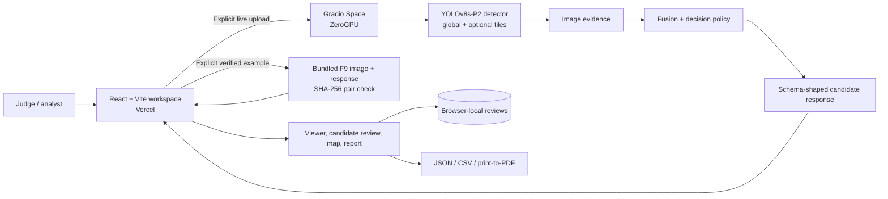
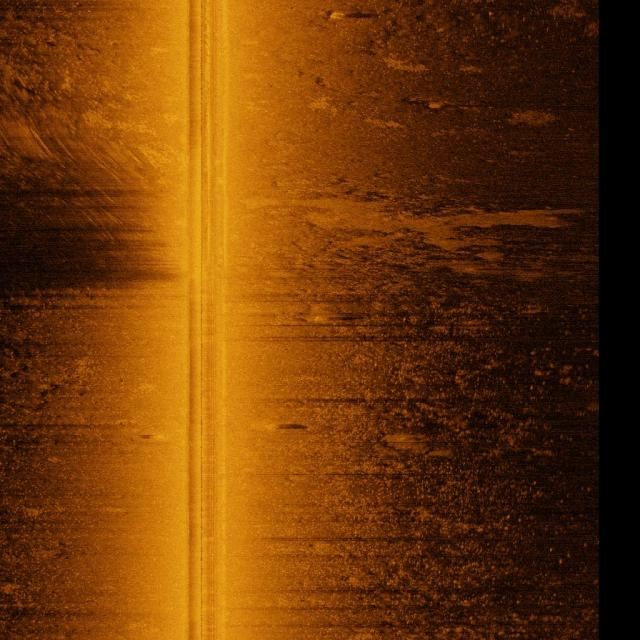

# SONAR-SHIELD

**A human-reviewed side-scan sonar analysis workspace.** Upload a JPG or PNG sonar image, inspect detected candidates and their evidence, record a separate human assessment, and export a browser-generated report. The public site uses a Hugging Face Gradio Space for best-effort live inference. When shared ZeroGPU capacity is exhausted, judges can explicitly open a clearly labeled, previously computed example.

[Open the app](https://sonarshield26.vercel.app/) · [Architecture](docs/ARCHITECTURE.md) · [Training and validation](docs/TRAINING_AND_VALIDATION.md) · [Frontend details](frontend/README.md)

> **Scope of this documentation:** It describes the checked-in source and the public deployment observed on 1 October 2026. The frozen F9 runtime examples, local FastAPI `/analyze` path, and hosted Gradio wrapper are distinct. Their evidence must not be merged into one accuracy or release claim. See [Known limitations](#known-limitations-and-open-work).

## What problem are we solving?

Side-scan sonar images contain small contacts against noisy seabed texture. A detector can identify candidate objects, but a box alone does not explain *why* the contact deserves attention, whether the input supports a geographic location, or what a reviewer decided. SONAR-SHIELD combines candidate detection with image-derived evidence, a fusion score and decision policy, provenance and quality fields, and an inspection interface. **A candidate is a lead for review, not a confirmed object or a navigation instruction.**

The five detector labels in the training configuration are crab pot, submarine pipeline, shipwreck, ghost net, and mine cylinder. The currently documented decision-validation scope is narrower: crab pot, shipwreck, and mine; pipeline and ghost net require review. A [class-ID mismatch in the checked-in backend](#known-limitations-and-open-work) must be fixed and revalidated before any class-specific production claim.

## One-minute system map



The Space is a **Gradio** deployment, not the local FastAPI server. The frontend calls the named Gradio endpoint `/analyze_image_gradio` through `@gradio/client`. Its API reachability indicator cannot establish available GPU quota. The verified-example path makes no Space inference request.

## Try it as a judge

1. Open [the public workspace](https://sonarshield26.vercel.app/analysis).
2. For a live run, **Browse image** or drop a JPG/PNG, then select **Run analysis**. A completed response is labeled **LIVE ANALYSIS**. Inspect boxes, candidate details, evidence, decision reasons, localization, and the report.
3. If ZeroGPU refuses a run, the uploaded image remains visible. The page explains the shared GPU limit. Select **View verified example**, read the explanation, and then select **Load precomputed example**. The app does not retry or silently substitute another image.
4. **Explore verified examples** is also available before uploading. Contact 105 is the default; Contact 103, Contact 104, and a zero-candidate background are bundled. These are paired F9 images and saved responses, and the browser checks their SHA-256 match before loading.
5. In either path, select a candidate, inspect its image evidence, choose a human assessment, save a note, and open **Reports**. The human assessment is separate from the AI decision. Example results retain **PRECOMPUTED EXAMPLE · NOT LIVE INFERENCE** in the viewer, review, report, print, and JSON/CSV exports. A verified example is **never** presented as an analysis of the judge's upload.

| Path | What runs now? | Image being analyzed | Source label |
| --- | --- | --- | --- |
| Live | Gradio/ZeroGPU inference, if quota permits | The uploaded image | `LIVE ANALYSIS` |
| Verified example | No new inference | The displayed bundled sample image | `PRECOMPUTED EXAMPLE · NOT LIVE INFERENCE` |

Contact 105 is the default verified sample shown in the viewer:



The Oracle 1 GB Micro VM is not used for inference or represented as a ZeroGPU quota solution.

## What we built

- **Candidate pipeline:** a YOLOv8s-P2 detector with global and optional tiled passes; image-derived geometry, seabed, shadow, and artifact evidence; a saved fusion model; and a rule-based decision stage. The local F8 `/analyze` implementation and F9 runtime evidence are in `ai/` and `backend_freeze/`.
- **Analyst workspace:** a zoomable sonar viewer, matching bounding boxes and candidate list, evidence and quality panels, a separately recorded human review, and a map that only plots backend-provided valid WGS84 coordinates. Pixel-only results stay pixel-only.
- **Reports:** current-session reports with unchanged AI output, local human notes, source labels, JSON/CSV export, and browser print-to-PDF. The deployed Space does not provide a report artifact or review endpoint.
- **Judging continuity:** a quota-specific message and four verified sample pairs. The fallback remains interactive even when the Space is offline.

See [the architecture document](docs/ARCHITECTURE.md) for service boundaries, response structure, and failure handling.

## Training story and what the evidence shows

The repository contains scripts for V1 through V6 experiments. V1 fine-tuned a pretrained Drishti detector. Later scripts tested hard negatives, targeted data refinement, higher-resolution hard positives, a larger YOLOv8m baseline, and finally a YOLOv8s-P2 small-object head with sonar-oriented augmentation. The **V6-P2** detector is named in the F9 freeze manifest. Training scripts record intended configurations; by themselves they do not prove that every run completed or establish comparable per-version results. The local dataset and model weights are excluded from GitHub.

| Recorded result | Value | Boundary |
| --- | ---: | --- |
| V6 validation `mAP@0.5` | 0.704 | `drishti_sss_v3` `val_clean`, from [`metrics.json`](ai/reference/metrics.json) |
| V6 validation `mAP@0.5:0.95` | 0.478 | Same recorded evaluation |
| V6 precision / recall | 0.747 / 0.691 | Same recorded evaluation; not a field deployment estimate |
| Crab-pot / shipwreck AP@0.5 | 0.343 / 0.505 | Illustrates uneven class performance |
| Background false positives | 26 detections on 324 images | Separate evaluation at confidence 0.25; 0.080 FP/image, from [`fp_benchmark.json`](ai/reference/fp_benchmark.json) |
| F9 runtime smoke | 10 real images | End-to-end functional check, not a statistical accuracy estimate |

The Gate B ablation found nearly equal global and hybrid `mAP@0.5` (0.7029 versus 0.7036) and the **same 98 false positives** in that evaluation. It does **not** support a broad claim that tiling improves accuracy. It *does* provide a concrete recovery case: Contact 105 had a spatially separate tiled crab-pot candidate missed by the global pass. Read the [training and validation notes](docs/TRAINING_AND_VALIDATION.md) for the chronology, source files, threshold differences, and unresolved evidence.

## Why this design is useful

| Capability | Practical value | Evidence / caveat |
| --- | --- | --- |
| Global plus optional tiled detection | Can expose a small, spatially distinct contact missed by a global pass | Contact 105 F9 audit; aggregate Gate B improvement is small |
| Evidence plus decision reasons | Lets a reviewer inspect more than a class label and confidence | Implemented in candidate response and UI; explanation quality is not a scientific guarantee |
| Separate human review | Preserves the AI decision while recording a reviewer assessment | Browser-local only; no shared audit service |
| Honest localization | Prevents invented map pins when navigation metadata is missing | Real bundled examples are pixel-only |
| Explicit offline example | Keeps a judging walkthrough usable during ZeroGPU quota or Space failure | Precomputed and visibly labeled; it does not test an uploaded image |

No external head-to-head benchmark against other sonar products is in this repository. These are design advantages and project-internal observations, **not** a claim of superior accuracy, speed, or operational readiness against competitors.

Compared with a **hypothetical box-only demo**, this project adds candidate-level evidence and reason codes, human review kept distinct from AI output, source-labeled examples, report exports, and a map that refuses to invent coordinates. This is an architecture comparison, not a measured benchmark against a named competitor.

## Local setup

### Frontend and public Space

Requirements: Git, Node.js `^20.19.0` or `>=22.12.0` (the checked-in Vite version's engine requirement), npm, a modern browser, and internet access for live Space analysis. No local model weights are needed to run the frontend or verified examples.

```powershell
git clone https://github.com/anugrahks19/SonarShield.git
cd SonarShield/frontend
npm ci
npm run dev
```

Open the URL Vite prints, normally `http://localhost:5173/`. The frontend defaults to `mrintrovert19/sonar-shield-api`. To use another **public** Gradio Space, copy `frontend/.env.example` to `frontend/.env.local` and set `VITE_GRADIO_SPACE_ID=owner/space`. Never put a Hugging Face token in a `VITE_*` variable: Vite exposes it in browser JavaScript. The Space must expose the same named endpoint and response shape.

```powershell
npm run build:release
npm run preview
```

`build:release` checks public configuration, lint, unit tests, TypeScript, and the production bundle. For offline and quota browser QA, serve the production preview with `.\node_modules\.bin\vite.cmd preview --host 127.0.0.1 --port 4182` on Windows (or `./node_modules/.bin/vite preview --host 127.0.0.1 --port 4182` on macOS/Linux). In another terminal run `python tests/browser_judge_fallback.py` and `python tests/browser_mock_gradio.py` from `frontend/`; those optional scripts require Python, Playwright, `pypdf`, and Chrome at the Windows path coded in the scripts. They intercept Space requests and do not consume ZeroGPU runs.

### Reproducing the local backend or training

This is a separate, artifact-dependent path. The checked-in `ai/api/gate_f8_api_server.py` expects `models/v6/detector_v6_p2_sss/weights/best.pt` and `ai/fusion/weights/gate_d_fusion_model.pkl` plus the decision-policy JSON files. The large weights, `.pkl` model, and datasets are ignored by Git. `huggingface_deployment/requirements.txt` is a deployment-oriented dependency list, not a locked full training environment. The recorded training environment used Python 3.12, PyTorch 2.4.1+cu121, Ultralytics 8.4.163, CUDA 12.1, and an RTX 4060 Laptop GPU; see [`environment.json`](ai/reference/environment.json). Several training scripts contain the original author's absolute Windows paths and require path/data adaptation before rerunning. **A fresh GitHub clone alone cannot reproduce training or launch the local model-backed API.**

The historic local FastAPI service exposes `/health`, `/detect`, `/analyze`, and `/report`. `/analyze` is its full path; `/detect` is a stub and `/report` does not serve a downloadable artifact. The public Vercel app uses the Gradio Space instead. For deployment and API details see [Architecture](docs/ARCHITECTURE.md) and [Hugging Face integration](frontend/docs/HUGGING_FACE_INTEGRATION.md).

## Repository guide

| Path | Purpose |
| --- | --- |
| [`frontend/`](frontend/) | React/TypeScript app, verified examples, browser exports, tests |
| [`ai/`](ai/) | Training, detection, evidence, fusion, decision, F8 API and gate scripts |
| [`backend_freeze/`](backend_freeze/) | F9 manifest, hashes, runtime smoke report |
| [`huggingface_deployment/`](huggingface_deployment/) | Checked-in Gradio Space packaging source |
| [`docs/ARCHITECTURE.md`](docs/ARCHITECTURE.md) | Deployment, live/example flows, contracts, storage |
| [`docs/TRAINING_AND_VALIDATION.md`](docs/TRAINING_AND_VALIDATION.md) | Experiments, recorded metrics, wins, failed assumptions |

## Known limitations and open work

1. **Class-ID mapping conflicts.** The V3 training YAML maps IDs `1/2/3/4` to pipeline/shipwreck/ghost-net/mine, while `ai/reliability/decision_engine.py`, the FastAPI server, and checked-in Gradio wrapper map those IDs to shipwreck/mine/pipeline/ghost-net. This can affect labels and class-specific policy routing. Fix the mapping at the backend boundary and rerun class-level validation before relying on live class-specific claims. This documentation does not change backend behavior.
2. **Hosted provenance includes placeholders.** The public Space's `app.py` source (checked 1 October 2026) and the checked-in wrapper set `input.sha256` to `dummy_sha`, use placeholder artifact hashes, and fill some reliability and localization uncertainty values with constants. The frontend validates the response *shape* but cannot convert those placeholders into measured evidence. Bundled F9 examples have matching real image hashes; do not conflate their saved response provenance with the live wrapper.
3. **Capacity is best effort.** ZeroGPU may reject live requests for quota. A reachable Space API is not proof of GPU availability. The explicit precomputed example is a walkthrough backup, not new inference.
4. **Persistence is local.** Human reviews are stored in this browser. Refresh removes the uploaded image and analysis response; loading the same saved response can recover its matching local reviews. There is no shared review endpoint, durable server-side analysis history, or downloadable backend report.
5. **Geography needs metadata.** The current real examples report pixel coordinates only. The map does not infer latitude/longitude, and no operational geolocation claim is made.
6. **Freeze and evaluation are incomplete.** The `backend-freeze-f9` Git tag contains only freeze metadata, the calibration hash records `FILE_NOT_FOUND`, and the F9 report's Contact 0 decision differs from the checked-in runtime reference. A ten-image smoke test is not independent field validation. See the [release audit](frontend/docs/RELEASE_AUDIT.md).

## Responsible interpretation

Use SONAR-SHIELD as a research/demo decision-support workspace. Treat outputs as review candidates, inspect the image and evidence, and keep human conclusions separate. Do not use the current hosted output as certified mine identification, geolocation, navigation, or safety-critical clearance.

## References in this repository

- [F9 runtime smoke and Contact 105 audit](backend_freeze/f9_runtime_validation.md)
- [Frozen component manifest](backend_freeze/FREEZE_MANIFEST.json)
- [V6 validation metrics](ai/reference/metrics.json) and [background false-positive benchmark](ai/reference/fp_benchmark.json)
- [Gate B global/tiled/hybrid ablation](ai/reference/gate_b_results.json)
- [Frontend release audit and unresolved blockers](frontend/docs/RELEASE_AUDIT.md)
