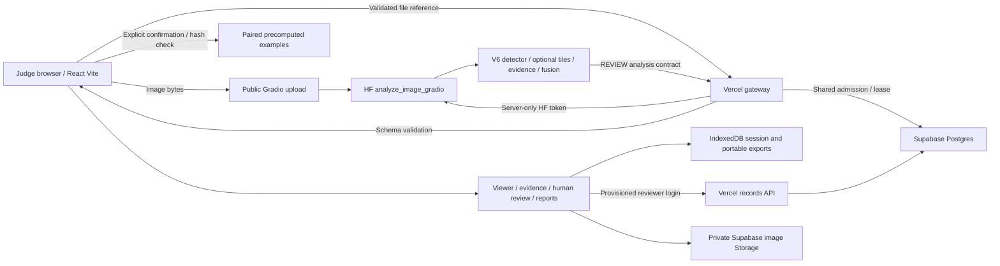

# SONAR-SHIELD

AI-assisted side-scan sonar candidate detection and human review for **PS 26057**, Ministry of Earth Sciences / NIOT.

[Public workspace](https://sonarshield26.vercel.app/analysis) · [Judge walkthrough](docs/JUDGE_WALKTHROUGH.md) · [Cloud demo setup](docs/JUDGE_CLOUD_DEMO.md) · [Architecture](docs/ARCHITECTURE.md) · [Demo downloads](submission/README.md) · [Submission package](docs/MODULE2_M212_SUBMISSION.md) · [Requirements matrix](docs/PS26057_COMPLIANCE.md)

## Current release: 4 October 2026

The public prototype supports JPG/PNG live analysis through an authenticated HF gateway, inspectable candidates, human review and reports. Explicit precomputed examples remain usable when ZeroGPU rejects inference. Browser persistence and optional authenticated Supabase records preserve paired images, results and review history.

**The new M2.08 detector is frozen locally as an experimental detector-only candidate, not deployed.** Its compatible fusion and calibration are not established. Current production uses the earlier V6-based runtime with REVIEW decisions and unavailable calibration. No model has demonstrated the requested 80% precision and 80% recall together. Public raw XTF inference remains disabled.

## Architecture and data flow



The browser uploads image bytes directly to HF; only a small file reference reaches the gateway. Tokens stay on the server. Everyone shares the service account's finite quota. API reachability does not prove GPU availability. Quota errors preserve bounded upstream details and any supplied reset countdown. No automatic inference retry occurs.

## Judge walkthrough

1. Open **Analysis**, choose a JPG/PNG and run analysis. Successful responses carry **LIVE ANALYSIS**.
2. If quota or service availability prevents inference, retain the uploaded image and read the reason. Choose **View verified example**, then explicitly confirm the sample.
3. **Explore verified examples** is available immediately. Contact 103, 104, 105 and a zero-candidate background have paired image/response hashes. They replay an earlier analysis of the displayed sample.
4. Select a candidate, inspect evidence, record a separate human assessment and note, then open **Reports**. Download JSON/CSV or print to PDF. Precomputed source labels remain visible throughout.
5. Export a complete paired record for portability. A provisioned Supabase reviewer can save a cloud record, sync reviews, sign in after refresh and reopen it. Stored analyses are client imported, not server-certified inference evidence.

See the [step-by-step script and failure branch](docs/JUDGE_WALKTHROUGH.md).

## Measured results: separate tasks, separate claims

### Latest detector-only comparison

All three use the same historical DEV: **1,129 images, 2,293 objects**. Below, global confidence thresholds maximize recall while maintaining micro precision >=80%. Matching is class-correct at IoU 0.5. mAP sweeps confidence/IoU, so it is not the selected-threshold precision.

| Candidate | Precision | Recall | False positives | mAP50 | mAP50-95 | GPU forward |
|---|---:|---:|---:|---:|---:|---:|
| D1 | 80.07% | 40.12% | 229 | 70.71% | 50.01% | 7.43 ms |
| **M2.08 selected** | **80.10%** | **41.43%** | **236** | **69.90%** | **49.73%** | **7.53 ms** |
| M2.10 | 80.03% | 40.38% | 231 | 70.35% | 49.89% | 8.23 ms |

M2.08's exact threshold is **0.3653043210506439**. It wins recall under this precision floor; D1 has the highest mAP. At confidence 0.25 M2.08 instead has P75.57%, R44.66%, FP331. Timing is warm batch-1 FP32/640 model forward on the RTX 4060 laptop, excluding network, queue and fusion. The prior local wall measurement was 10.92 ms.

**These are reused DEV selection measurements, not independent field accuracy or deployed system metrics.** This pool's ghost nets are synthetic. A tuned detector score is not calibrated probability. See [final selection and release evidence](docs/MODULE2_M211_RELEASE.md).

### Historical frozen benchmarks

V6-P2 clean-validation summary: P74.7%, R69.1%, mAP50 70.4%, mAP50-95 47.8%, as recorded in [reference metrics](ai/reference/metrics.json). Historical D2 fusion candidate-test evidence reported recall 88.3% to 91.7%, precision 31.8% to 43.7%, FP455 to FP284 (37.6% reduction). These candidate-filtering figures use a different task/protocol and cannot be transferred to M2.08 or called system accuracy. [Training chronology and original evidence](docs/TRAINING_AND_VALIDATION.md).

## Training: corrections, gains and failures

- Source audit found empty-label hard-positive crops, invalid boxes, overlapping revisions and test-informed history. A new mechanically curated exploratory revision preserved the originals: 9,369 TRAIN / 1,129 inherited DEV. Automated screening does not establish expert label correctness or source rights.
- User completed D1 80 epochs, M2.08 15 epochs and M2.10 10 epochs. M2.08 used targeted TRAIN sampling and shorter fine-tuning; M2.10 corrected inherited bias warmup. No third run is planned for submission.
- Small crab pots and shipwrecks remain difficult. Scale/tiling checks and short runs did not achieve 80/80. More epochs alone are not evidence of improvement. The final candidate has mixed metrics, not a universal win.
- Class mapping and schema/provenance repairs are implemented in the software. Older policy/fusion artifacts still lack verified identity and calibration for the new detector. Automatic confirmation remains disabled.
- The raw XTF renderer initially produced black low-amplitude UINT16 windows. Its rendering was corrected and local image/review/export flows checked. Visible rasters and candidate counts do not establish target accuracy.

The [Module 2 ledger](docs/MODULE2_PROGRESS.md) preserves phase evidence. Frozen experimental weights live locally under `models/submission/m211_detector_only_20261004/`; large weights/datasets are not included in a fresh GitHub clone.

## Advantages and limitations

| Capability | Practical value | Limit |
|---|---|---|
| Small-object P2 head and optional tiles | Candidate coverage at multiple image scales | No broad tiling accuracy improvement established |
| Evidence and reason fields | Reviewers can inspect supporting pixels and uncertainty | Explanation quality and confidence need independent validation |
| Separate human review/history | Preserve AI output while recording reviewer decisions | Cloud content is client imported |
| Paired examples and source labels | Honest judging continuity during quota failure | No inference on the judge's image |
| Metadata-dependent geolocation | Avoid invented locations and dimensions | Known contacts and geometry need field verification |
| Local XTF and edge API | Path toward offline survey processing | No actual AUV/Jetson/Pi throughput or power certification |

No external competitor benchmark exists. These are implemented workflow distinctions, not proven superior accuracy. Supported motion/slant/dropout handling remains partial. Exact field location, terrain correction, true-net generalization and independent raw-XTF precision/recall remain unverified.

## Setup

### Frontend and examples

Use **Node 24.x**, as declared in `frontend/package.json`.

```powershell
git clone https://github.com/anugrahks19/SonarShield.git
Set-Location SonarShield/frontend
npm ci
npm run dev
```

Open the printed local URL. Examples need no model or reviewer login. Live requests additionally need the local gateway or deployed Vercel API. Copy `.env.gateway.example` to ignored `.env.gateway.local`, set server-only variables privately and run in another terminal:

```powershell
npm run dev:gateway
```

Use `APP_ORIGIN=http://localhost:5173` locally. For production use `https://sonarshield26.vercel.app`. Keep `HF_TOKEN`, Supabase secret and `CRON_SECRET` out of `VITE_*` variables, Git and screenshots. [HF gateway guide](frontend/docs/HUGGING_FACE_INTEGRATION.md) and [Supabase setup](docs/SUPABASE_VERCEL_SETUP.md) describe exact values, migration/member provisioning and rollback.

```powershell
npm run build:release
npm run preview
```

### Local raw-sonar and future edge interface

Supply trusted ignored weights and isolated dependencies from `requirements-inference.txt` and the raw requirements documented in [Module 1 release](docs/MODULE1_RELEASE_20261003.md). A fresh clone alone cannot run model-backed inference.

```powershell
python scripts/start_survey_dashboard.py --output-dir .temp/survey-dashboard
```

Raw XTF processing is bounded and local. Without a reviewed source-bound geometry profile, output stays pixel-only. [XTF review gate](docs/XTF_ACCURACY_RELEASE.md) describes confirmed annotation and independent 90/90 release prerequisites. [Edge API](docs/EDGE_DEVICE_API.md) provides an authenticated local image contract for future device integration, not underwater connectivity or vehicle control. `/analyze` is the full local path; `/detect` is deprecated, not a supported detector shortcut. Reports are generated by the UI.

## Release evidence and future targets

M2.11 passed 47 frontend tests, 52 backend tests, four freeze safeguards, 12 metric reconciliations, release build/credential scan, local SQL regressions and five browser scenarios. Public/local fallback walkthroughs made zero HF inference calls. Mock live success is not real authenticated inference. User previously confirmed cloud review restoration, five hosted admission checks and maintenance HTTP200; actual expired-object deletion is not demonstrated by HTTP200 alone.

Future **80/80 and 90/90 are goals**, not predicted results. Achieving them requires independently confirmed real targets and natural backgrounds, acquisition-disjoint TRAIN/DEV/CALIB/TEST, improved small-target labels/localization, controlled experiments, compatible fusion refitting/calibration and frozen external evaluation. Public XTF additionally needs verified rendering/navigation. [Current requirement boundaries](docs/PS26057_COMPLIANCE.md).

Use this prototype for research and analyst review. It is not certified mine clearance, navigation or cleanup positioning.

## Repository guide

| Path | Purpose |
|---|---|
| `frontend/` | UI, gateway, cloud routes, examples and tests |
| `ai/` | Runtime, detection, evidence, fusion, schemas and local APIs |
| `scripts/` | Audits, guarded experiments, raw workflows and release tooling |
| `supabase/` | Migration and hosted verification SQL |
| `huggingface_deployment/` | Gradio deployment source |
| `backend_freeze/` | Historical F9 evidence |
| `docs/metrics/` | Structured measurements and release records |
| `submission/m212_20261004/` | Local judge deck and indexed package; generated, not deployed |
