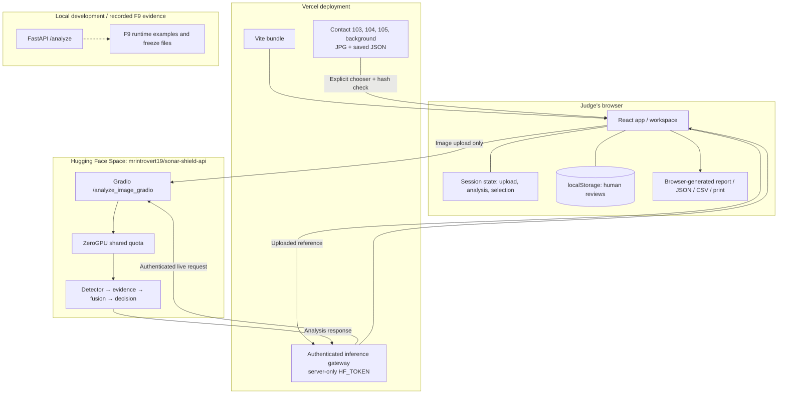
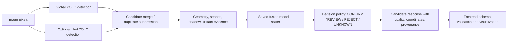
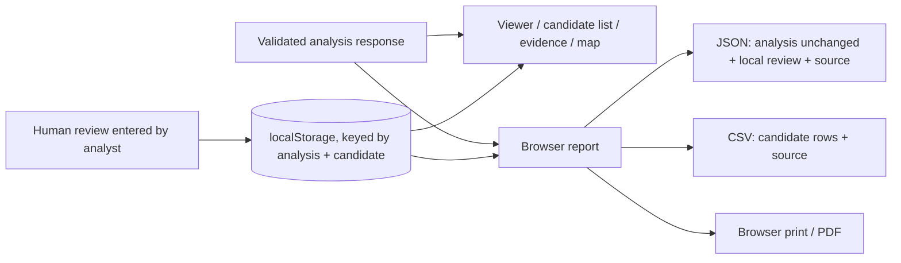

# SONAR-SHIELD architecture and data flow

[Project overview](../README.md) · [Training and validation](TRAINING_AND_VALIDATION.md) · [Frontend integration](../frontend/docs/HUGGING_FACE_INTEGRATION.md)

## 1. Deployment boundary

SONAR-SHIELD has three distinct contexts. A browser-delivered React app runs on Vercel. Its **live** adapter calls the public Hugging Face Gradio Space. A **local** FastAPI implementation and F9 gate artifacts live in this repository for development and validation; the Vercel build does not call those FastAPI routes. The app also ships four static, paired example image/response assets for an explicit walkthrough when live inference is unavailable.



The diagram shows the current integration boundary, not an assurance that the hosted wrapper and F9 checkpoint are identical. The Space file `app.py` was read from its public source on 1 October 2026 and still contains placeholder provenance values described below.

## 2. Live request sequence

The browser accepts JPG/PNG files and retains the selected image in a browser object URL. It uploads image bytes directly to the public Space using Gradio's upload method, then sends the small uploaded file reference to the same-origin Vercel `POST /api/analyze` gateway. The gateway validates the cache path, uses a server-only `HF_TOKEN` to submit `/analyze_image_gradio` with `run_tiled_auxiliary: true`, handles data/error/completion events, and unwraps the first output. The browser validates that object with Zod against the existing F8-shaped analysis contract before rendering. A newer selection invalidates an older pending result. All gateway visitors share the service account's quota; secrets never enter the public bundle. The 300-second function has a 270-second controlled timeout and best-effort upstream cancellation. [Gateway setup, errors, development, and rollback](../frontend/docs/HUGGING_FACE_INTEGRATION.md) document the new transport.

```mermaid
sequenceDiagram
  actor Judge
  participant UI as Vercel React app
  participant Gateway as Vercel inference gateway
  participant Space as Hugging Face Gradio
  participant Pipeline as Hosted pipeline
  Judge->>UI: Select JPG/PNG; Run analysis
  UI->>UI: Show uploaded image; mark running
  UI->>Space: Connect and upload image
  UI->>Gateway: POST /api/analyze with uploaded reference
  Gateway->>Space: Authenticated submit(/analyze_image_gradio)
  alt ZeroGPU accepts run
    Space->>Pipeline: Detector, evidence, fusion, decision
    Pipeline-->>Space: F8-shaped response
    Space-->>Gateway: response.data[0]
    Gateway-->>UI: Analysis object
    UI->>UI: Parse and schema-validate
    UI-->>Judge: LIVE ANALYSIS, candidates and report
  else Authenticated service account quota exceeded
    Space-->>Gateway: Original ZeroGPU limit error
    Gateway-->>UI: Redacted reason + supplied reset time
    UI-->>Judge: Keep upload visible; explain limit
    Judge->>UI: View verified example
    UI-->>Judge: Explain sample and no new inference
  end
```

The service badge reports Space API reachability and marks GPU capacity as unverified; it is not a GPU health probe. A quota error gets its own `GPU_QUOTA_EXCEEDED` state; a transport failure is `API_OFFLINE`. There is no automatic retry or automatic substitution of an example. The source label changes only after the appropriate response is loaded.

**Code:** [`frontend/src/api/analysis.ts`](../frontend/src/api/analysis.ts), [`frontend/src/api/gradioError.ts`](../frontend/src/api/gradioError.ts), [`frontend/src/api/schema.ts`](../frontend/src/api/schema.ts), [`frontend/src/App.tsx`](../frontend/src/App.tsx).

## 3. Inference pipeline and contract

The checked-in local F8 and hosted Gradio sources share the broad stage order below. The F9 smoke report records a real end-to-end run with frozen detector/fusion/decision artifacts. The separate `ai/gates/gate_f9_pipeline.py` is a **mock integration scaffold** and must not be cited as the real F9 runtime test; the real run is recorded by `ai/gates/gate_f9_real_e2e_runner.py` and `backend_freeze/f9_runtime_validation.md`.



- **Detection:** `TiledDetector` uses the V6-P2 detector weight, a global pass, and optional overlapping image tiles. Its candidate confidence floor is 0.15 in the local F8 initializer. The additional tiled path can recover small contacts, while duplicate handling and false positives remain concerns.
- **Evidence:** `extract_all_evidence` calculates candidate geometry, local seabed statistics, shadow-related measurements, and artifact/quality features from image pixels and boxes.
- **Fusion and decisions:** the saved scikit-learn pipeline consumes a named feature vector. `DecisionEngine` uses the resulting score, class policy, and a known-profile anomaly check to produce a decision and reason codes. `UNKNOWN` is an anomaly signal against learned profiles, not identification of a never-seen physical object.
- **Coordinates:** candidate boxes are in image pixels. Geographic coordinates are only shown when valid backend WGS84 values exist; the real bundled examples report `PIXEL_ONLY`. The frontend never converts pixels into latitude/longitude.
- **Response:** `analysis_id`, `input`, `summary`, `candidates`, `artifacts`, and `processing` form the F8-shaped object. Each candidate carries detection, evidence, classification, decision, localization, uncertainty, quality, and provenance fields. The browser does not recompute AI decisions.

See [`ai/api/f8_api_schema.py`](../ai/api/f8_api_schema.py), [`ai/api/candidate_schema.py`](../ai/api/candidate_schema.py), and the [F9 report](../backend_freeze/f9_runtime_validation.md). The UI checks structure, not scientific truth or the authenticity of placeholder fields.

### Important hosted-wrapper caveat

The current public Gradio source builds a schema-shaped response but uses `dummy_sha` for the uploaded image hash, placeholder artifact hashes (`detector_hash`, `fusion_hash`, and similar strings), a fixed reliability estimate, and fixed localization uncertainty values. The local FastAPI `/analyze` computes the image SHA-256 but also emits placeholder provenance artifact hashes and some fixed metadata. These fields must be repaired and the hosted response revalidated before claiming full live provenance or calibrated uncertainty. In the F9 **bundled examples**, the image and saved-response SHA-256 values match; that verification applies to the example pair only.

The V3 dataset YAML maps class IDs `0..4` to crab pot, pipeline, shipwreck, ghost net, mine. The checked-in decision engine and API wrappers instead interpret `0..4` as crab pot, shipwreck, mine, pipeline, ghost net. This mismatch can change displayed class names and which decision policy branch runs. It is a current backend defect, not a frontend display choice.

## 4. Verified-example sequence

The four static image/response pairs live under [`frontend/public/`](../frontend/public/). The user must open the chooser and confirm the explanation. The browser fetches both files from Vercel, schema-validates the response, computes the image SHA-256, compares it with `input.sha256`, and only then replaces the active view. If either asset or check fails, the current image is retained and an error is shown. Nothing in this sequence calls Hugging Face.

```mermaid
sequenceDiagram
  actor Judge
  participant UI as React app
  participant CDN as Vercel static assets
  Judge->>UI: Explore verified examples
  UI-->>Judge: Contact 105 is precomputed; no inference
  Judge->>UI: Confirm selected example
  UI->>CDN: GET contact-105.json and contact-105.jpg
  CDN-->>UI: Saved response and sample image
  UI->>UI: Validate schema; compare SHA-256
  UI-->>Judge: PRECOMPUTED EXAMPLE · NOT LIVE INFERENCE
  Judge->>UI: Inspect, review, map, report, export
  Note over UI,CDN: Zero Gradio inference requests for this path
```

**Code:** [`frontend/src/components/ui/VerifiedExamples.tsx`](../frontend/src/components/ui/VerifiedExamples.tsx), [`frontend/src/App.tsx`](../frontend/src/App.tsx), [`frontend/src/components/reports/ReportPage.tsx`](../frontend/src/components/reports/ReportPage.tsx), [`frontend/src/reports/export.ts`](../frontend/src/reports/export.ts).

## 5. State, review, and exports



The app keeps the uploaded image and analysis response in React session state, not durable storage. Refresh loses both. Reviews are stored in this browser, keyed by `analysis_id` and `candidate_id`; they can reappear when the *same* response is loaded again. A review does not alter the AI candidate. The report and downloads are generated client-side from the current validated response plus matching local reviews. Source disclosure is present in the report and exports. There is no shared reviewer identity, server write-back, report-download API, or persistent analysis record.

## 6. Local and hosted setup boundaries

| Need | Required inputs | Command / route | Result |
| --- | --- | --- | --- |
| Run UI with public Space | Node and npm | `cd frontend`, `npm ci`, `npm run dev` | Live best-effort inference plus verified examples |
| Build release bundle | Node and npm | `cd frontend`, `npm run build:release` | Lint, tests, typecheck, `dist/` |
| Run example path offline | Built frontend only | Open **Explore verified examples** | No model, Space, or GPU needed |
| Run local F8 inference | Python environment and ignored model/fusion artifacts | `python -m uvicorn api.gate_f8_api_server:app --app-dir ai --host 127.0.0.1 --port 8000` | Local `/analyze`, separate from hosted frontend |
| Reproduce training | Original datasets, ignored weights, GPU environment, path adaptations | Scripts under `ai/train_v*.py` | Research workflow, not one-click from GitHub clone |

The local FastAPI command is a source-level orientation, **not a promise that a fresh clone can start it**. The required weights and `.pkl` are ignored by Git, and the training scripts contain machine-specific absolute paths. The previous [`deployment_guide.md`](../deployment_guide.md) describes an abandoned Docker/FastAPI Space plan; follow the Gradio integration guide for the current public app.

## 7. Verification and release boundary

The frontend release command passed 24 unit tests, lint, TypeScript, and Vite build on 30 September 2026. Local Chrome checks blocked the Space and completed all four examples, review, report, JSON/CSV, and print with zero additional inference calls. A separate mocked Gradio test exercised quota rejection and successful live rendering without using ZeroGPU. The public Vercel page served the built JavaScript bundle and Contact 105 assets after the push. Those checks verify application behavior; they do not establish live GPU availability, model accuracy, class correctness, or full F9 freeze integrity.

See [`frontend/tests/browser_judge_fallback.py`](../frontend/tests/browser_judge_fallback.py), [`frontend/tests/browser_mock_gradio.py`](../frontend/tests/browser_mock_gradio.py), and the [release audit](../frontend/docs/RELEASE_AUDIT.md). The audit is historical and predates the current deployed Gradio integration; use its unresolved F9 findings, not its old deployment-status line, as the current limitation record.
