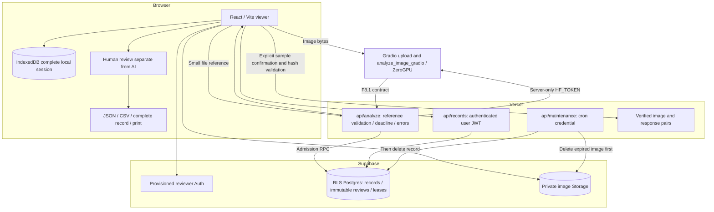
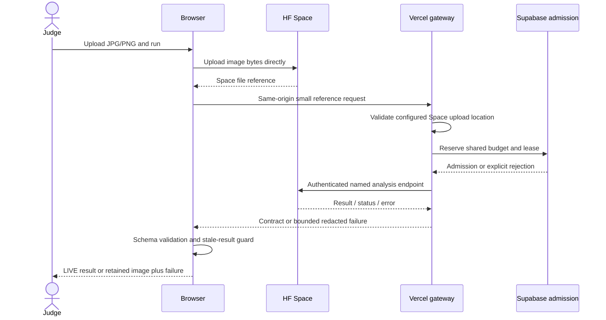
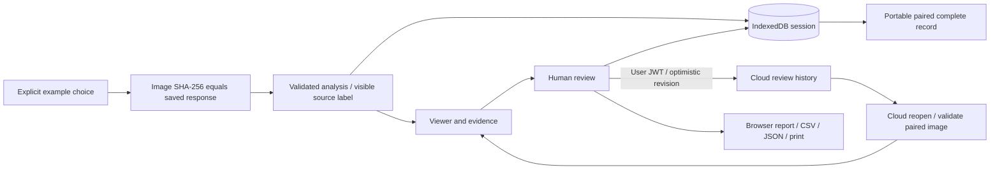
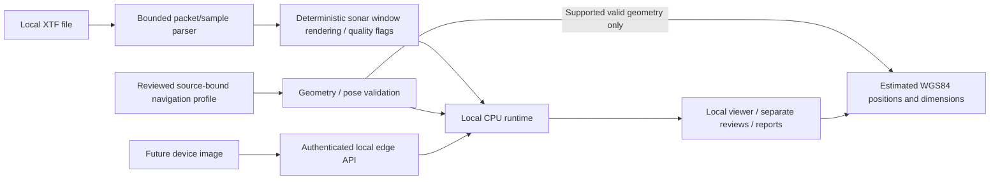

# SONAR-SHIELD architecture

Updated 4 October 2026. [Overview](../README.md) · [Setup](SUPABASE_VERCEL_SETUP.md) · [Release scope](MODULE2_M211_RELEASE.md)

## Service boundaries

## Live request

The Vercel function limit is 300 seconds with an earlier controlled timeout. No automatic inference retry or anonymous fallback occurs. Cancellation stops browser waiting and attempts upstream cancellation; consumed quota may remain consumed. Reachability and inference availability are separate. Origin checks reduce accidental cross-site use but do not authenticate public visitors. Shared database admission does not make HF quota unlimited.

## Runtime and artifact identity

Production uses the V6-based shared runtime: canonical classes, global plus optional tiled proposals, merging, image evidence, fusion features, REVIEW decisions and an F8.1-shaped response with actual input/artifact identity where available. Unsupported calibrated probabilities remain unavailable. Older policy/fusion identity does not establish compatibility with the M2.08 experimental weights.

The experimental detector bundle pins FP32/640/batch1, NMS0.7, max300, confidence floor0.001 and post-NMS threshold >=0.3653043210506439. It excludes fusion/calibration and is not enabled in production. [Frozen manifest](metrics/module2-m211-frozen-manifest-20261004.json).

## Examples, persistence and exports

Examples make no inference calls and never analyze an earlier uploaded image. Source labels persist in reports and downloads. IndexedDB restores the complete local session; storage permissions/capacity may prevent it, so portable exports remain important. Reviews retain their analysis/candidate identity and do not overwrite machine decisions. Optional cloud records use provisioned Supabase users, RLS, private paired images and immutable review revisions. Cloud content is client imported, not an independent scientific attestation. Reviewer sign-in is needed again after refresh.

## Raw and edge paths

Raw processing is local and bounded, not available as public Vercel XTF inference. The low-amplitude UINT16 rendering defect was corrected. Supported flat-bottom slant/pose/lever-arm handling is conditional; full terrain and motion correction and field accuracy remain incomplete. Missing units, datum, pose or geometry stay unavailable. The edge API is a future integration contract, not AUV hardware certification.

## Verification and recovery

M2.11 records actual test/build and browser scope in [release evidence](MODULE2_M211_RELEASE.md). Mock responses prove UI contract behavior, not real model quality. Restore a previous verified Vercel deployment for web rollback while preserving Supabase data. HF rollback needs a verified runtime/weights revision, not the experimental D1 backup. Portable records are analyst backups; retention is not backup. [Judge and rollback instructions](JUDGE_WALKTHROUGH.md).
