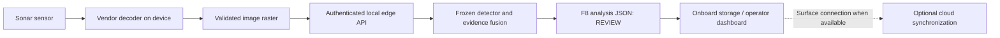

# Future edge-device integration

Prepared 3 October 2026. This adapter runs the existing frozen runtime locally. It is an image-analysis interface, **not tested AUV integration or vehicle control**. The Windows workstation is the only measured hardware. An AUV underwater generally needs onboard processing; this endpoint does not provide an underwater internet connection.



## Start locally

Install `requirements-inference.txt` in an isolated environment and supply the existing trusted weights. Configure `SONAR_EDGE_TOKENS_JSON` as a JSON object mapping a device ID to a unique random token of at least 32 characters. Store this in the process environment or a protected service configuration; never commit it or put it in a browser variable. Generate random tokens with `secrets.token_urlsafe(32)` locally. The API is disabled without configured tokens.

```powershell
python -m uvicorn ai.api.edge_server:app --host 127.0.0.1 --port 8767
```

For a real LAN/device deployment, terminate TLS in a secured reverse proxy, allow only required device addresses, and configure that device's token securely. Do not expose the development server directly to the internet. Token revocation requires removing its entry and restarting the service. These are device credentials, not Supabase reviewer credentials.

## Contract

Every request needs `Authorization: Bearer <device-token>`.

| Endpoint | Behaviour |
| --- | --- |
| `GET /v1/edge/capabilities` | Limits and supported inputs; no model initialization or inference |
| `POST /v1/edge/analyze` | Raw PNG/JPEG bytes, `Content-Type: image/png` or `image/jpeg`; optional `X-Request-Id` of 1–64 letters/digits/underscores/hyphens |

Maximum 32 MiB encoded and 16 million decoded pixels; one analysis at a time; tiled analysis enabled. Identity comes from the configured token, not a caller-supplied device ID. Response contains `adapter_version`, `source=LOCAL_EDGE_INFERENCE`, `device_id`, `request_id`, UTC receipt timestamp, actual input SHA-256 and unchanged `analysis` F8 contract. Detector scores are not calibrated accuracy. No geographic coordinates are generated without validated navigation; this initial endpoint accepts image bytes only. Raw XTF uses the separate local survey adapter.

401 authentication failure; 413 size limit; 415 unsupported content type; 422 invalid image/request ID; 503 busy or missing runtime artifacts. No automatic retry, cloud fallback or HF inference calls. Request IDs support traceability, **not idempotency**: resending runs inference again. The client should persist results and retry only deliberately. Disconnecting stops the client waiting; native inference may finish and is not refunded or forcibly interrupted.

Future hardware needs vendor decoding, independently checked rendering, navigation/pose integration, performance/power measurements and deployment packaging appropriate to its CPU/GPU/OS. A generic HTTP contract does not establish compatibility with every sonar or AUV.

## Example device request

With the matching credential already provisioned as `SONAR_EDGE_TOKEN` in the client process environment:

```powershell
$deviceHeaders = @{ Authorization = "Bearer $env:SONAR_EDGE_TOKEN"; 'X-Request-Id' = 'frame-000001' }
Invoke-RestMethod -Uri 'http://127.0.0.1:8767/v1/edge/capabilities' -Headers $deviceHeaders
Invoke-RestMethod -Uri 'http://127.0.0.1:8767/v1/edge/analyze' -Method Post -Headers $deviceHeaders -ContentType 'image/png' -InFile 'frame.png'
```

Use HTTPS instead of the loopback URL for a secured network deployment. Any device capable of making this HTTP request can implement a client, but sensor decoding, navigation, hardware throughput and field performance need their own validation. Nothing in this example commands an underwater vehicle.
