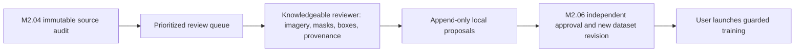

# M2.05 — Annotation review workspace

Prepared 3 October 2026. **Software preparation complete; human review and dataset approval pending.** No training, inference, deployment, source-label changes, or metric improvement is claimed.

## Open the workspace

Local review page: http://127.0.0.1:8771/ . To restart it in PowerShell:

```powershell
Set-Location 'E:\GITHUB\a sih 2026'
python -B scripts/review_module2_annotations.py --output .temp/module2-annotation-review-20261003 --serve --port 8771
```

It is bound to localhost, not the public website. Keep the review directory: its SQLite database holds append-only proposal history. Export history from the page before moving machines. This workspace is a local preparation tool, not authenticated cloud collaboration or independent certification.

## Queue and review order

17,552 items: 11,657 primary-source image reviews, 10 confirmed training/native-test overlaps, and 5,885 protected-role similarity pairs. These are tasks, not independent sample counts. Similarity candidates came from a capped screen and are not proven duplicates. Broad M2.04 raster inventory also contains illustrations/derived figures; this primary-source queue excludes the vessel configuration diagram and derived training revisions.

1. **83 crab-pot images with out-of-bounds boxes** and the malformed native mine annotation. Compare original yellow boxes with actual visible target boundaries. Submit justified pixel-coordinate corrections; do not clip automatically. Native MILCO/NOMBO categories retain their names, not assumed hazard classes.
2. **251 shipwreck image/mask pairs**, including all-black masks and fragmented shapes. Establish foreground semantics and intended object instances. No automatic connected-component-to-object conversion. Inspect the 10 known training/native-test overlaps: those images are ineligible as fresh holdouts regardless of later review.
3. **5,885 protected-role similarity pairs**. Establish actual site/sequence identity, supported by source evidence. Similar appearance alone cannot certify shared acquisition or independence.
4. **Empty and missing annotations**. Inspect the whole raster at sufficient resolution; an empty inherited label does not establish natural background. China image-level labels and unlabelled UXO imagery need boxes before supervised detection use. Unknown cases stay uncertain.
5. Confirm source semantics, acquisition groups and licensing evidence. Real-net capability needs real labelled sonar nets; synthetic nets remain synthetic evidence. Resolve the crab source's conflicting licensing text and unverified source grants before redistribution.

## Reviewer procedure

Filter by dataset/issue. Inspect source metadata, yellow inherited boxes and separate original masks. For high-resolution imagery, open the original local image at native resolution before final decisions: displayed previews are bounded to 1,800 pixels and may hide small targets. No display enhancement or prediction is presented as ground truth.

Enter reviewer identity, a reason and supporting evidence. Corrections use JSON objects with **original-image pixel coordinates**:

```json
[{"category":"Crab-Pot","x":20,"y":30,"w":15,"h":18}]
```

`CONFIRM_EXISTING` proposes retaining source annotations. `CONFIRM_BACKGROUND` proposes target absence after inspecting full-scene coverage and cannot contain boxes. `UNCERTAIN` is preferred to guessing. Group decisions must record acquisition evidence. Rights and semantic fields are supporting notes, not automatic approvals. Use `EXCLUDE` for inappropriate imagery or unverifiable claims.

Every submission remains **PROPOSAL_NOT_DATASET_APPROVAL**. M2.06 must validate reviewer competence, annotation completeness, source identities, rights, group separation and role history before constructing a new approved revision. Neither a browser button nor a name typed into a form establishes expert certification. No review can erase previous training/test exposure.



## Safeguards and verification

- Original image, YOLO/mask and native crab metadata hashes are bound to decisions. Changed sources reject saving and require a new audit/review queue.
- Box bounds, finite coordinates, reviewer/reason fields and decision vocabulary are validated. Correction proposals require positive boxes; background proposals reject boxes.
- The server accepts indexed images only, binds to 127.0.0.1, checks Host and Origin, requires a per-process write token and bounds request sizes. Source paths are rendered as text. No arbitrary image URL or filesystem path is accepted through the image route.
- SQLite proposals are durable and append-only; reopening restores the latest proposal. History export retains earlier revisions and image/label hashes. Training loaders do not consume this database.
- **Nine unit tests passed**: history/roundtrip, unchanged source labels, source drift, invalid bounds/non-finite values, required fields, empty-positive prevention and native-category preservation.
- Isolated Chromium browser QA passed save → refresh → restore → export, mask and pair rendering, mobile layout, rejected unauthenticated write and invalid indexed reference. No page errors or external requests. QA decisions were kept in a separate fixture directory and never placed in the real queue.

Private queue: `.temp/module2-annotation-review-20261003/queue.json`. Private source-audit evidence remains in `.temp/module2-source-audit-20261003`. The real review workspace starts with zero submitted decisions. Model weights and deployed behavior remain unchanged. This is not evidence of improved precision/recall, and public XTF inference remains gated.

## Handoff

Next phase: **M2.06 build a reviewed dataset revision**. Prepare technical build checks now if requested, but do not treat unreviewed proposals, source folder labels or model guesses as approved detection labels. Training is not ready merely because this workspace exists.
