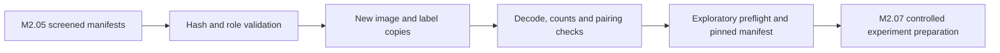

# M2.06 — Separate mechanically curated dataset revision

Prepared 3 October 2026. **Technical construction complete, subject to the saved build and preflight evidence.** This revision uses inherited labels and is exploratory; expert annotation approval, rights resolution and independent survey evaluation remain incomplete. No training or inference ran.

## Revision

`E:\GITHUB\a sih 2026\datasets\mechanically_curated_r01_20261003`

| Split | Images | Purpose |
|---|---:|---|
| TRAIN | 9,369 | Screened inherited positive examples |
| DEV | 1,129 | Preserved historical experiment comparison |
| Calibration | 0 | No independent calibration pool was invented |
| Final evaluation | 0 | No previously exposed split was relabelled as untouched |
| Confirmed natural negatives | 0 | Uncertain empty labels remain excluded |

| Canonical class | TRAIN boxes | Historical DEV boxes |
|---|---:|---:|
| crab_pot | 8,757 | 1,275 |
| submarine_pipeline | 1,000 | 147 |
| shipwreck | 1,959 | 544 |
| ghost_net | 765 | 135 |
| mine_cylinder | 1,240 | 192 |

Ghost-net labels remain synthetic evidence. Canonical classes are inherited from the baseline; native MILCO/NOMBO was not newly converted to mine/cylinder. A class count does not validate semantics, completeness or field performance.

## What was built

- Separate image and label copies under `images/train`, `labels/train`, `images/val`, `labels/val`. Original bytes and text were retained without automatic clipping, enhancement or category changes.
- `data.yaml`: canonical five-class TRAIN/DEV paths, without test or calibration paths.
- `manifest.json`: copy identities, original source and label hashes, crop parent identities, inherited annotation basis, raster dimensions and explicit scientific limitations.
- `exclusions.json`: preserved M2.05 per-image exclusion reasons; nothing deleted from the source dataset.
- `build-report.json`: class counts, size strata after aspect-preserving letterbox scaling to 640, immediate source-revision counts and annotation-basis counts. Size strata use box area: small <32², medium <96², large otherwise. They are raster-scale summaries, not physical dimensions or AP measurements.
- `preflight.json`: existing exploratory integrity validator results.
- `READY.json`: pinned YAML/manifest hashes. **READY means integrity readiness only, not expert approval or permission to train.**
- `BUILD_STATUS.json`: completion indicator; an interrupted/failed build stays incomplete and cannot be overwritten in place.

The baseline `controlled_v8a_20261003`, the interrupted 60-epoch run, model weights and deployed systems were not edited. Dataset binaries remain ignored by Git. No human review proposal was fabricated or promoted into an approved label.

## Boundaries verified

1. M2.05 eligibility, DEV and exclusion manifests still match their saved hashes. Native metadata still matches screening provenance.
2. Each input image, annotation, parent and source annotation matches the baseline manifest before copying.
3. Images decode successfully and match the baseline's OpenCV decoded identity; copies match original byte hashes.
4. Parsed labels retain the recorded box count and valid five-class geometry.
5. TRAIN and DEV have no exact byte, decoded-image or recorded-parent overlap. This is **not** proof of survey/site independence or exhaustive near-duplicate absence.
6. Every image pairs with its exact-stem label; no destination collisions, extra files or missing manifest files. Each class has TRAIN and DEV support.
7. The existing `train_corrected_candidate.preflight` passes without importing the model or launching training.

Six builder tests cover valid roles, parent/pixel leakage rejection, unconfirmed empty TRAIN rejection, role/curation status safeguards, and copy/hash/size/source-drift behavior. Actual build verification additionally checks every copied record.

## Important experiment limitation

The size report exposes a concrete mismatch: **2,424 of 8,757 TRAIN crab boxes are small (27.7%), versus 1,248 of 1,275 DEV crab boxes (97.9%)**. The next experiment should address small-target exposure/context deliberately, rather than assume that more enlarged crops or merely restarting 80 epochs solves recall. Existing geometry-derived crops retained in this revision: 834; other TRAIN images: 8,535. Immediate recorded source revision is Drishti V3 for both roles; this does not establish original acquisition identity.

This is a **positive-only exploratory pool**, not a scientifically approved final training mix. Excluding uncertain empty labels avoids asserting that unknown scenes contain no targets, but removes background supervision. That can hurt false-positive performance. Missing objects inside inherited positive scenes are still possible. Neither reduced dataset size nor a successful integrity check establishes improved precision, recall or mAP.

M2.07 should prepare an explicit controlled experiment and evaluate against the unchanged baseline/DEV. It must preserve the negative-data limitation and use a new run directory. No 80% or 90% result is promised. Real target annotations, trustworthy negatives, rights resolution and independent groups remain necessary for final accuracy claims and public XTF release.

## Reproduce preparation or verification

Use a new output path for another build; this path is already populated:

```powershell
Set-Location 'E:\GITHUB\a sih 2026'
python -u -B scripts/build_module2_curated_dataset.py --handoff .temp/module2-automatic-handoff-20261003-verified --output datasets/mechanically_curated_r02
```

Integrity verification of the completed revision, **no training**:

```powershell
python -u -B scripts/train_corrected_candidate.py --dataset datasets/mechanically_curated_r01_20261003
```

The old launcher's default run name belongs to the preserved baseline. **Do not add `--execute` to this verification command.** M2.07 will prepare a distinct run configuration/launcher before the user starts training. Starting reference weights are pinned V6 for validator compatibility; this does not assert they are better than the interrupted candidate.



## Next phase

**M2.07 can start now for controlled detector experiment preparation.** M2.06 closes technical construction, not scientific dataset approval. Training remains unstarted; improved metrics must be measured after a later user-launched experiment.
