# Module 2: controlled route to the 90/90 goal

Started 3 October 2026. Goal: class-correct object precision >=90% **and** recall >=90% at the same frozen operating point on independently labelled data. This is a target, not a guarantee or a system-accuracy percentage. An image-only validation result cannot certify raw XTF performance.

## Current findings: M2.01 kickoff

The read-only audit inventoried 27,880 image entries in V8-A TRAIN and Drishti V3 TRAIN, val_clean, val, test and benchmark_bg. Counts include images reused between revisions; this is not 27,880 independent scenes. Full image hashes, label hashes/errors and crop lineage were saved privately under `.temp/module2-kickoff-audit-20261003`. Checked-in [summary evidence](metrics/module2-kickoff-audit-20261003.json) records exact identities and scope.

- V8-A: 12,401 training images. **919 of 920 lineage-listed hard-positive crops have empty labels in the current on-disk revision.** An empty YOLO detection label represents background to the loader, so this revision is unsuitable as a hard-positive enrichment without repair. This audit does not establish what an earlier run loaded from a cache or a different revision.
- V8-A and Drishti V3 TRAIN each have 141 files with boxes outside the original normalized raster boundary or otherwise failing the declared label check. These must be reviewed; clipping or deleting labels automatically is not a semantic correction.
- There are 1,318 exact-byte cross-role hash groups. Most are expected-to-be-related historical aliases: 995 DEV_CANDIDATE/HISTORICAL_VALIDATION, 322 HISTORICAL_BACKGROUND/HISTORICAL_VALIDATION and one HISTORICAL_BACKGROUND/HISTORICAL_VALIDATION/TRAIN. Do not describe all 1,318 as training/test leakage; the one TRAIN overlap must be excluded from independent background evidence.
- All 920 recorded crop parents were found by source hash in the inventoried pools; no recorded crop parent was found in DEV/test while its crop was in TRAIN. This limited exact-hash check does not certify site/mission independence or absence of near duplicates.
- Current V8-A YAML uses `drishti_sss_v3/test/images` as training validation. Its saved args reference that YAML. Preserve V8-A as test-informed exploratory work; those test data cannot become a fresh final holdout by renaming them.
- The raw XTF review pack has 162 unreviewed windows and no confirmed target labels. It stays excluded from training and final accuracy claims until independently reviewed.

No training, inference, relabeling, moving, deleting or model promotion occurred in this kickoff. The deployed V6-based detector remains unchanged. Existing crop/source licenses, human annotation quality, acquisition groups, near duplicates and pretraining/selection history still require review; M2.01 is **partially complete**, not signed off.

## Ordered next work

```mermaid
flowchart LR
 A[M2.01: lineage, labels and leakage audit] --> B[M2.02: protected splits and evaluation rules]
 B --> C[M2.03: comparable DEV baselines]
 C --> D[M2.04: corrected and reviewed targeted data]
 D --> E[M2.05: one controlled detector experiment]
 E --> F[M2.06: compatible evidence fusion]
 F --> G[M2.07: calibration and frozen operating point]
 G --> H[M2.08: untouched external evaluation]
 H --> I[M2.10: reviewed promotion and public XTF integration]
```



1. Complete M2.01 by reviewing erroneous labels and crop geometry/parent boxes, source rights, ever-used roles and acquisition identity. Preserve existing pools and outputs. Any repairs belong in a **new dataset revision** with before/after hashes and reviewed reasons, not the active V8-A folder. Do not automatically create a negative for an uncertain or missing annotation.
2. M2.02 freezes train/DEV/CALIB/final roles and evaluator definitions. Final data must be group-disjoint, independently labelled and sufficiently cover all advertised classes. Exclude known training duplicates and previously test-informed evaluation pools from final evidence. Unknown provenance stays unknown.
3. M2.03 compares the frozen V6 and available exploratory candidates only on permitted DEV data with identical processing. Diagnose misses, wrong classes, natural-background false alarms and small-object/scale failures. Existing metrics from different splits are not a fair leaderboard.
4. M2.04 fixes the documented crop-label defect and boundary errors in reviewed new revisions, then adds real difficult positives and confirmed natural negatives. New sonar gain/noise/scale augmentations must preserve valid boxes and be justified by DEV failures. XTF-derived positives need expert labels, not model pseudo-truth.
5. M2.05 changes one major factor per experiment. Corrected-label fine-tuning comes before speculative model enlargement. Resolution/tiling/sampling experiments follow only if measured failures justify them. Training is launched by the user, never automatically by this agent.
6. M2.06 regenerates compatible evidence for the selected detector and evaluates fusion at matched recall; it cannot recover targets that were never proposed. M2.07 fits supported calibration on CALIB and freezes the complete bundle. Unsupported classes stay explicitly uncalibrated.
7. M2.08 evaluates once the pipeline and untouched external set are locked. Report precision, recall, mAP50/50-95, each class, background false alarms, acquisition strata and uncertainty; model optimization, if needed, precedes this gate. A failed goal remains a failed result, not a reason to reinterpret the holdout as DEV without reserving new evidence.
8. Passing the reviewed [XTF release criteria](XTF_ACCURACY_RELEASE.md) makes public integration eligible. M2.10 then packages the verified rendering/model/fusion/calibration bundle, preserves rollback, and runs public upload-to-report checks. Passing accuracy numbers alone does not automatically deploy a backend or establish geographic correctness.

## Commands now versus later

Audit only, using a fresh output directory:

```powershell
Set-Location 'E:\GITHUB\a sih 2026'
python -B scripts/audit_module2_data.py --output .temp/module2-audit-next
```

**Do not relaunch `ai/train_v8_a.py` with its current YAML.** No replacement dataset is approved yet. After review, a new `datasets/approved_sonar/data.yaml` and `split-manifest.csv` must contain the actual separate TRAIN/DEV image paths, hashes, verified labels and acquisition groups; those paths are prerequisites, not currently populated training data.

```powershell
python -B scripts/train_guarded.py --data datasets/approved_sonar/data.yaml --manifest datasets/approved_sonar/split-manifest.csv --weights models/v6/detector_v6_p2_sss/weights/best.pt --dry-run
```

Only after this preflight and the provenance/evaluation gates pass, the user can launch a bounded experiment:

```powershell
python -B scripts/train_guarded.py --data datasets/approved_sonar/data.yaml --manifest datasets/approved_sonar/split-manifest.csv --weights models/v6/detector_v6_p2_sss/weights/best.pt --epochs 80 --device 0 --project models/controlled --name reviewed_candidate_01 --execute
```

80 epochs is an initial experiment setting, not a promise of 90/90. Threshold tuning alone commonly trades precision against recall; both must meet the goal together. Existing frozen scores remain uncalibrated until supported calibration is produced.
