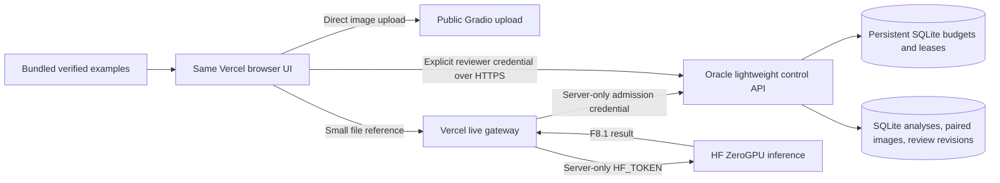

# Oracle-compatible records and usage-control service

Prepared 2 October 2026. Implementation and local tests are complete; the user's Oracle VM has not been accessed or changed. This service contains **no inference model**, does not require a GPU or HF token, and cannot bypass ZeroGPU quota. Its role is durable records, paired images, review history and global gateway admission.

## Hosting choice

An existing Oracle E2 Micro has 1 GB RAM and persistent boot/block storage. A lightweight single-worker API and SQLite are a reasonable small-demo workload; verify actual spare resources before installation. Oracle may reclaim idle Always Free instances. Keep private backups outside that VM. Check console eligibility and current usage; no unlimited availability/capacity guarantee.

Render free web services sleep after 15 minutes and cannot attach persistent disks. A normal HF Space filesystem is ephemeral. Neither is an appropriate location for this SQLite database without independent persistent storage.

Sources checked: [Oracle](https://docs.oracle.com/en-us/iaas/Content/FreeTier/freetier_topic-Always_Free_Resources.htm), [Render](https://render.com/docs/free), [HF](https://huggingface.co/docs/hub/main/spaces-storage).

## Architecture



HF_TOKEN belongs only in Vercel. SONAR_ADMISSION_TOKEN belongs privately in Vercel and the control server. Reviewer credentials are separate; they are typed into the optional Shared records panel and stay in browser memory. They are not stored in localStorage, IndexedDB, exports or built assets. Anonymous judging and verified examples still work without reviewer login.

## Local setup first

Create an isolated Python 3.12 environment; install `requirements-control.txt`. No torch/ultralytics/OpenCV package is required. Configure privately:

| Variable | Purpose |
|---|---|
| SONAR_RECORDS_DB | Durable SQLite path, e.g. `/var/lib/sonar-shield/records.sqlite` |
| SONAR_REVIEW_TOKENS_JSON | JSON map of reviewer IDs to independently generated opaque credentials, minimum 32 characters |
| SONAR_REVIEW_TEAMS_JSON | Optional reviewer-to-team map; members can read/write/delete team records. Omit for owner-only isolation. |
| SONAR_RECORD_RETENTION_DAYS | 1–3650; default 30. Expired records/images/history are pruned on database access. |
| SONAR_ADMISSION_DB | Separate durable SQLite file, e.g. `/var/lib/sonar-shield/admission.sqlite` |
| SONAR_ADMISSION_TOKEN | Independent opaque server credential, minimum 32 characters |
| SONAR_DAILY_RUN_LIMIT | Site admission budget; default 20 per UTC day |
| SONAR_CONCURRENT_RUN_LIMIT | Default 1 |
| SONAR_LEASE_SECONDS | 360–3600; default 600 |
| SONAR_ALLOWED_ORIGINS | Exact browser frontend origins, including `https://sonarshield26.vercel.app` |

Generate credentials privately with a cryptographic generator (e.g. `secrets.token_urlsafe(32)`); never put values in chat, source or VITE variables. Restrict the environment file to its service account. Do not reuse HF_TOKEN. Use HTTPS and an exact origin allowlist; CORS is not authentication.

```powershell
python -m uvicorn ai.api.control_server:app --host 127.0.0.1 --port 8093 --workers 1
```

For local browser tests include `http://127.0.0.1:4182` in allowed origins. Production must use a trusted HTTPS URL.

## Oracle deployment preparation

Use a separate service account and directory. The example `deploy/sonar-control.service` runs one worker with a 384 MiB memory ceiling, binds only localhost and loads a private environment file. Adjust paths after reviewing existing VM services. Install code and the small control requirements in a separate virtual environment; do not install inference dependencies on the 1 GB VM.

Expose it through an HTTPS reverse proxy and a valid certificate for your chosen domain. The example `deploy/sonar-control.nginx.conf` supplies request-size/time and connection limits; supply your own certificate paths. Expose 443, restrict SSH, and keep port 8093 private. Never replace unrelated existing proxy configurations wholesale. The inference host remains HF; raw-survey jobs run on the local workstation or a separately verified processing host.

After the service is reachable and its persistence/backup checks pass, set **server-only Vercel** variables:

- SONAR_ADMISSION_URL = the HTTPS base URL, without `/admission`.
- SONAR_ADMISSION_TOKEN = the matching private controller credential.

Redeploy the gateway and verify admission rejection before HF connect, success, controller outage and timeout. When either admission variable is set incorrectly, live requests fail closed. With neither variable set, the legacy gateway remains operational **without the new global controls**. Do not claim production protection before activation. No deployment has occurred in this task.

## Budget and failure semantics

SQLite transactions enforce one persistent budget across gateway instances. An admitted request spends a site budget entry even if HF subsequently rejects it; this conservative counter is distinct from HF GPU seconds and reset times. Completed successful runs release their lease. Errors/cancellation retain the lease until expiry because upstream may still be running. A lease is an admission safeguard, not proof of GPU availability or a quota refund. A malicious visitor can exhaust a public site's finite allowed budget; this prevents unbounded admission, not denial of service or unlimited inference. Distributed infrastructure failure does not trigger anonymous HF fallback.

## Records, storage and operations

Analysis JSON is immutable; uploaded records are CLIENT_IMPORTED_UNATTESTED. Pairing checks exact image hashes for corrected F8.1 and historical precomputed fixtures, image dimensions, file decoding and pixel limits. Legacy live records have independent paired-image integrity but unverified legacy scientific provenance. Images are immutable, limited to 32 MiB each and 256 MiB total. Record JSON is limited to 2 MiB, notes to 20,000 characters and each owner/team to 100 records. DELETE removes the paired image and revisions. Team members have equal read/write/delete rights; finer roles/SSO are a later enhancement, not implied.

Open **Shared records and review history** in the workspace, enter the service URL and issued reviewer credential, then connect. Saving stores analysis + image; syncing reviews is an explicit separate action. Existing different reviews require confirmation for a new revision; concurrent edits return a conflict. Opening a record restores viewer/report locally with its original source label and runs no inference. Disconnect clears the credential. Reviewer tokens should be rotated/revoked in server configuration when access changes.

```powershell
python -B scripts/backup_records.py path/to/records.sqlite path/to/new-records-backup.sqlite
python -B scripts/backup_records.py path/to/admission.sqlite path/to/new-admission-backup.sqlite
```

The SQLite backup API creates consistent backups and refuses overwrite. Backups include private images and notes; encrypt/control access and store outside the VM. To restore, stop the service, preserve the current DB, restore a verified backup to its configured location, fix ownership, and restart. Admission restoration can restore stale budgets/leases; review the UTC day and let leases expire conservatively. Automatic remote backup scheduling and restore drills need the chosen VM/account and are not activated by this task.

## Rollback

Preserve the two DB files and old application revision before release. Roll back compatible application revisions; do not silently reinterpret classes/calibration. Removing both Vercel admission variables deliberately disables these controls, so record that exposure before rollback. Shared records can be disconnected without affecting browser-local sessions or the verified-example workflow.
