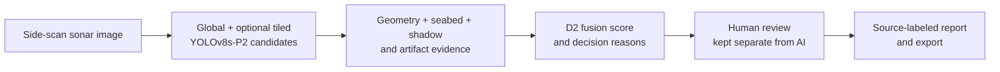

# Slide-ready figures: measured results and future goals

[Project README](../README.md) · [Training evidence](TRAINING_AND_VALIDATION.md) · [Editable vector graphic](assets/validation-metrics.svg)

Use the measured numbers below as **results** and the future numbers as **proposed targets**. They are different evaluation tasks. Do not combine detector mAP with candidate-filtering precision or call mAP “system accuracy.” The [SVG figure](assets/validation-metrics.svg) is 16:9 and can be inserted directly into PowerPoint.

## Slide 1 — What SONAR-SHIELD does

**Suggested headline:** “From sonar contact to reviewable decision.”

**Talk track:** “A box alone is not the outcome. We expose supporting image evidence, preserve the model decision, let an analyst record a separate judgment, and report exactly whether the result was live or a precomputed example.”

**Uniqueness to claim:** an integrated review workflow with evidence, honest pixel-only localization, provenance/quality fields, and a transparent ZeroGPU backup. This is an **architecture distinction**, not proof that we outperform an external commercial sonar system.

## Slide 2 — Detector benchmark (measured)

**Suggested headline:** “Frozen V6-P2 detector on the clean validation split.”

| Precision | Recall | mAP@50 | mAP@50–95 |
| ---: | ---: | ---: | ---: |
| **74.7%** | **69.1%** | **70.4%** | **47.8%** |

**Caption:** YOLOv8s-P2, `drishti_sss_v3` `val_clean`, source: [`ai/reference/metrics.json`](../ai/reference/metrics.json). This is a detector benchmark on that split. It is not end-to-end system accuracy, live-site success rate, or an external field test. Per-class AP@50 is uneven: crab pot **34.3%**, shipwreck **50.5%**.

## Slide 3 — Why evidence fusion matters (measured)

**Suggested headline:** “Fewer false candidate alerts at slightly higher recall.”

| Metric | AI confidence only | D2 evidence fusion |
| --- | ---: | ---: |
| Recall | 88.3% | **91.7%** |
| Precision | 31.8% | **43.7%** |
| False positives | 455 | **284** |

**Large callout:** **171 fewer false positives · 37.6% reduction.**

**Technical footnote for the slide:** “Project-internal, image-grouped TEST candidate pool: 794 candidates, 240 class-agnostic box matches at IoU ≥ 0.50. AI-only and fusion thresholds were selected separately on CALIB for about 90% recall; metrics above were computed on the same held-out TEST pool.”

**Source and reproducibility:** [`ai/fusion/gate_d2_final.py`](../ai/fusion/gate_d2_final.py), [`ai/reference/gate_c_all_val_results.json`](../ai/reference/gate_c_all_val_results.json), the [saved recomputation record](metrics/d2_candidate_test_recomputed.json), and local ground-truth labels (excluded from GitHub). On 1 October 2026, the checked-in evaluation was rerun in memory with `joblib.dump` disabled. It produced AI-only **TP 212 / FP 455 / FN 28 / TN 99** and D2 **TP 220 / FP 284 / FN 20 / TN 270**. Thus `(455 − 284) / 455 × 100 = 37.5824%`, which rounds to **37.6%**, not 37.5%. The labels' absence from GitHub blocks independent reproduction from a fresh clone.

These figures describe **candidate filtering after proposals already exist**. A TP is a box overlap with any labeled object; class correctness and one-to-one object matching were not checked. They cannot be added to or substituted for the detector mAP values. They do not prove mine identification, operational clearance, or unseen-sensor performance.

## Slide 4 — What worked and what still failed

| Worked in the recorded tests | Still limited |
| --- | --- |
| D2 retained 220/240 positive candidates and cut FP 455→284 versus matched AI-only scoring | 284 false positives remain on the TEST candidate pool |
| Contact 105's optional tiled pass recovered a spatially distinct candidate missed by global detection | Gate B hybrid mAP@50 improved only 0.7029→0.7036; tiling alone was worse |
| Four image/response pairs let judges complete viewer→review→report without ZeroGPU | A replay is not live inference on a judge's upload |
| UI preserves AI decision separately from human review and avoids invented map points | Live backend class-ID mapping and placeholder provenance need repair |

**Talk track:** “Our strongest measured result is not a vague accuracy number: the matched candidate-pool comparison shows substantially fewer false alerts at similar or higher recall. We also show the failure modes and keep a reviewer in control.”

## Slide 5 — Next validation targets (**proposed, not achieved**)

Do not present this table as a forecast or current performance. These are engineering goals to test **after** class mapping, provenance, and split integrity are fixed. Use a newly locked external survey/sensor test set; tune thresholds only on development and calibration sets.

| Future target | Current reference | Proposed acceptance goal | How to pursue it |
| --- | ---: | ---: | --- |
| Detector mAP@50 | 70.4% on `val_clean` | **≥75%** on a new external set | More real rare-class examples; audit label quality; tune small-object training and tiles |
| Detector mAP@50–95 | 47.8% on `val_clean` | **≥55%** on the same external set | Improve box annotation consistency, boundary supervision, and resolution study |
| Detector recall at a stated operating point | 69.1% validation summary | **≥75% at ≥75% precision** on the external set | Class-balanced sampling, hard positives, threshold chosen on CALIB |
| Class-agnostic candidate-match precision | 43.7% on current grouped TEST | **≥50% at ≥90% recall** on a new locked candidate pool | Better evidence features, hard negatives, class-aware calibration |
| Candidate false-alert reduction | 37.6% versus AI-only on current TEST | **≥40%** versus matched AI-only baseline on the new pool | Same proposals and labels; separate CALIB thresholds; paired evaluation |
| Background false detections | 8.0 per 100 images in the separate 324-image benchmark at confidence 0.25 | **≤5 per 100 images** in a new background set at a preregistered operating point | Mine seabed/artifact hard negatives; report recall alongside FP |

**Evaluation gate:** freeze data sources and splits by survey/mission, prevent near-duplicate frames crossing splits, repair class IDs and hosted provenance, pre-register confidence/decision thresholds and metrics, then report **both** class-agnostic candidate matching and class-correct per-class results with uncertainty intervals on the untouched external set. The current class-correct baseline is not established, so this table does not invent one. If a target is missed, show the measured result rather than adjusting the target after the test. Report inference latency separately on specified hardware; shared ZeroGPU queue time is not model latency.

## Wording to avoid

- “70.4% system accuracy.” **Use:** “70.4% detector mAP@50 on `val_clean`.”
- “91.7% detection recall.” **Use:** “91.7% class-agnostic candidate-match recall among the 240 positives in the D2 held-out TEST pool.”
- “37.5% fewer false positives.” **Use:** “37.6% fewer false-positive candidates (455→284) on that matched pool.”
- “We will reach 80% accuracy after training.” **Use:** “We propose explicit external-set targets and will report the observed result.”
- “The Space is online, so inference is available.” **Use:** “The API is reachable; ZeroGPU capacity is unverified until a run succeeds.”

## Presenter note on current backend caveats

The checked-in training YAML class-ID order conflicts with the decision engine and public Gradio wrapper, and live Space provenance includes placeholders such as `dummy_sha`. The F9 tag is not a complete source/artifact freeze. These issues must be resolved before using the slide numbers to imply an operationally validated system. See the [limitations section](../README.md#known-limitations-and-open-work).
