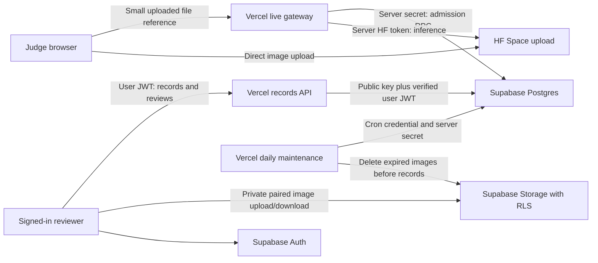

# Supabase + Vercel setup

Selected deployment: existing React/Vite interface and Vercel APIs, Supabase Auth/Postgres/private Storage, and the existing authenticated Hugging Face live model. No Oracle VM is needed. Implementation is locally tested; hosted activation is pending.



## 1. Apply the schema

Open your Supabase project's **SQL Editor → New query**. Copy the entire file `supabase/migrations/202610020001_sonar_cloud.sql` and run it once. It creates the private `sonar-records` bucket, restricted RPCs and tables. Do not make the bucket public or grant direct table writes. The migration is transactional and intentionally not rerunnable over an existing installation; if it reports existing objects, stop and inspect before proceeding.

## 2. Provision reviewers

In **Authentication → Providers**, disable public email sign-ups. In **Authentication → Users**, create an email/password user with email confirmed (dashboard labels can vary). Set a strong password privately; copy that user's UUID. Password recovery is currently an administrator operation; no recovery UI is implemented. Do not depend on default email delivery for judging.

Run this separate query, replacing the placeholder with the UUID from Authentication:

```sql
insert into public.sonar_members(user_id)
values ('REPLACE_WITH_AUTH_USER_UUID'::uuid)
on conflict do nothing;
```

Optional team sharing: generate one UUID for your team, then add each provisioned reviewer:

```sql
insert into public.sonar_team_members(team_id,user_id)
values ('REPLACE_WITH_TEAM_UUID'::uuid,'REPLACE_WITH_AUTH_USER_UUID'::uuid)
on conflict do nothing;
```

Leave the UI team field empty for private records. Teammates can read/review a shared record; only its owner can delete it. Cloud reviewers must be provisioned members even if they can authenticate. Sessions stay in browser memory and require sign-in after reload or expiry.

## 3. Configure Vercel

Use **Project → Settings → Environment Variables**, Production environment. Keep these names exact; there are no `NEXT_PUBLIC_*` or `VITE_*` credentials for this integration.

| Name | Value |
|---|---|
| `SUPABASE_URL` | `https://ujmhbrfvwguubyxllqtv.supabase.co` |
| `SUPABASE_PUBLISHABLE_KEY` | Your project's `sb_publishable_…` key; deliberately public |
| `SUPABASE_SECRET_KEY` | A `sb_secret_…` key from Supabase Settings → API Keys; server only |
| `SONAR_ADMISSION_PROVIDER` | `supabase` |
| `CRON_SECRET` | A new random credential of at least 32 characters; server only |
| `APP_ORIGIN` | `https://sonarshield26.vercel.app` |
| `HF_TOKEN` | Keep your existing HF read token; server only |

Legacy `SUPABASE_SERVICE_ROLE_KEY` is accepted instead of `SUPABASE_SECRET_KEY`, but use the modern secret key for new setup. Never paste secrets in chat, source files, browser settings or screenshots. Vercel's Node.js runtime must be **24.x**; the project declares this version. Redeploy the completed source after SQL and settings are ready. Adding environment values to an older deployment does not install these routes.

Supabase URL and publishable key are intentionally returned by `/api/records` GET. Record requests use the signed-in reviewer JWT, verified against Auth; they never use the service secret. Admission and maintenance alone use the service secret. Images bypass Vercel through private Storage, so files over Vercel's request-body limit do not pass through the gateway. The image limit is 32 MiB and 16 million decoded pixels on restore.

## 4. Limits and operational behavior

- Global defaults: **20 live admissions per UTC day**, **one concurrent admission**, **600-second safety lease**. Budgets are transactionally shared by all Vercel instances. Reservations consume the site budget even when HF fails; no quota refund is promised. HF has its own independent finite quota.
- Supabase failures reject live requests before inference when this provider is enabled. There is no anonymous or unprotected automatic retry. Public visitors can still exhaust the shared budget; origin checks do not authenticate judges or prevent scripts forging an Origin header.
- **Eight records globally**, up to 32 MiB/image and 2 MiB/analysis, **200 review revisions per record**, 30-day expiry. These conservative limits leave room within the free tier. The settings table deliberately caps records at eight. Uploaded objects cannot be overwritten; partial uploads can be retried with the same immutable record, or the owner can delete it.
- `/api/maintenance` runs daily at 03:00 UTC via Vercel cron, authenticated by `CRON_SECRET`. It deletes expired Storage objects before pruning database rows; failures keep rows for a later retry. Retention is not a backup.
- Cloud records are explicitly **client imported, not server-certified AI evidence**. The API validates the contract and restored images must match their SHA-256 and dimensions. A reviewer can submit client-controlled content; storage does not constitute independent scientific attestation. Original stored AI content is immutable, while reviews append optimistic revisions.
- Supabase may pause inactive free projects; free projects do not include automatic database backups. Check activity before judging. Export important paired records and reviews through the application's portable record export; maintain your own secured database/storage backups if a full recovery guarantee is required. Free service availability and quotas can change.

## 5. Local development and rollback

From `frontend`, use Node 24 and an ignored `.env.gateway.local` file with the server variables above, plus `APP_ORIGIN=http://localhost:5173`. Run `npm run dev:gateway` and `npm run dev` in separate terminals. Vite proxies `/api` to port 8787. Never commit the env file. Use a separate Supabase test project for destructive tests.

To roll back the deployment, redeploy the previous verified Vercel deployment and preserve the Supabase project/data. Never drop tables or delete the bucket as a rollback shortcut. Removing `SONAR_ADMISSION_PROVIDER` disables the new distributed protection, so do not present that configuration as protected. Browser-local sessions, exports and verified examples remain usable without cloud reviewer sign-in. The previous SQLite implementation remains available for local development at `?legacy-records=1` on Vite dev; its deployment documentation is historical, not the selected cloud path.

## Verification

Local evidence: 45 frontend/server tests, lint/typecheck/release build and built-asset credential scan; embedded PostgreSQL migration/RLS tests; mocked cloud browser paired-record and review restoration. These do not verify hosted Auth, Storage, Vercel cron, function packaging or live HF inference.

For SQL regression tests from the repository root:

```powershell
npm install --prefix .temp/supabase-sql-test --save-exact @electric-sql/pglite@0.5.8
node scripts/test_supabase_sql.mjs
```

Production gate: verify `/api/records` exposes only public config, sign in as two reviewers and test owner/team isolation, save/open paired records and restore reviews, check maintenance and persistent admission, then deliberately run one authenticated HF analysis and inspect viewer/report/export source labels. Never claim Module 1 complete until remaining real-survey, hardware and production gates in `MODULE1_IMPLEMENTATION.md` are closed.

Official references: [API key boundaries](https://supabase.com/docs/guides/getting-started/api-keys), [Storage policies](https://supabase.com/docs/guides/storage/security/access-control), [free tier](https://supabase.com/pricing), [Vercel cron authorization](https://vercel.com/docs/cron-jobs/manage-cron-jobs).
