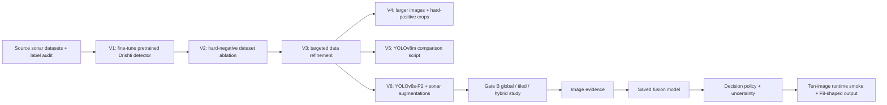

# Training, experiments, results, and honest limits

[Project overview](../README.md) · [Architecture](ARCHITECTURE.md) · [F9 runtime report](../backend_freeze/f9_runtime_validation.md)

This document separates **training configurations**, **saved evaluation numbers**, and **runtime checks**. A script describes what its author intended to run. A saved result file records a measurement under a specific dataset and threshold. The F9 ten-image run checks that components work together. None of these alone proves field reliability or a comparison against another sonar product.

## Problem and labels

The detector was developed for five side-scan sonar contact categories. The V3 dataset configuration gives this order:

| Training ID | Dataset label |
| ---: | --- |
| 0 | crab pot |
| 1 | submarine pipeline |
| 2 | shipwreck |
| 3 | ghost net |
| 4 | mine cylinder |

Source: local `datasets/drishti_sss_v3/drishti_v3.yaml` and the class order in [`ai/reference/metrics.json`](../ai/reference/metrics.json). The dataset, its license records, and model weights are ignored by the GitHub repository; a fresh clone cannot independently re-evaluate the numbers. The checked-in API and decision engine use a conflicting ID order for IDs 1–4; see [the release issues below](#open-issues-before-scientific-or-operational-claims).

## Experiment path

| Stage | What the checked-in script specifies | What can be concluded here |
| --- | --- | --- |
| V1 | Fine-tune a pretrained Drishti detector on a merged sonar dataset, 50 epochs, 640-pixel input | Starting approach is documented; the script is not a saved result table |
| V2 hard negatives | Resume a V1 checkpoint with a changed dataset and otherwise matching hyperparameters | Controlled dataset-ablation intent is documented; do not claim an improvement without its comparable outputs |
| V3 | Train YOLOv8s on targeted V3 data at 640 pixels | Preparation for later comparisons; no per-version metric is quoted here |
| V4 | Add capped, multiscale hard-positive crops and train at 960 pixels | Explicit attempt to improve small contacts; do not assume success from the script alone |
| V5 | Train a YOLOv8m baseline on V3 at 640 pixels | Larger-model comparison was planned; no head-to-head conclusion is supported here |
| V6 | YOLOv8s-P2, 640 pixels, 80 maximum epochs, patience 15, batch 8, seed 0, sonar-oriented augmentation | Detector named by F9 freeze manifest; saved V6 metrics below |

Scripts: [`ai/train_v1.py`](../ai/train_v1.py), [`ai/train_v2_hn.py`](../ai/train_v2_hn.py), [`ai/train_v3.py`](../ai/train_v3.py), [`ai/train_v4.py`](../ai/train_v4.py), [`ai/train_v5.py`](../ai/train_v5.py), [`ai/train_v6.py`](../ai/train_v6.py). Dataset-building and audit scripts include [`merge_data.py`](../merge_data.py), [`audit_datasets.py`](../audit_datasets.py), and [`build_drishti_v4_clean.py`](../build_drishti_v4_clean.py). Several scripts refer to `E:\GITHUB\a sih 2026` and need their paths adapted elsewhere.

## Recorded detector result

[`ai/reference/metrics.json`](../ai/reference/metrics.json) names `yolov8s-p2` on `drishti_sss_v3`, `val_clean`. It records:

| Measure | Recorded value | Interpretation |
| --- | ---: | --- |
| mAP@0.5 | 0.704 | Detector validation summary at one IoU threshold |
| mAP@0.5:0.95 | 0.478 | Stricter multi-threshold box metric |
| Precision | 0.747 | Validation split, not live deployment precision |
| Recall | 0.691 | Validation split, not field recall |
| Crab-pot AP@0.5 | 0.343 | Weakest listed class; contact detection remains hard |
| Submarine-pipeline AP@0.5 | 0.995 | High in this split; policy is still review-only/uncalibrated |
| Shipwreck AP@0.5 | 0.505 | Moderate in this split |
| Ghost-net AP@0.5 | 0.995 | High in this split; policy is still review-only/uncalibrated |
| Mine-cylinder AP@0.5 | 0.682 | In this validation split |

The JSON also records `inference_time_ms: 13.2`; that is a detector evaluation measurement, **not** an end-to-end Space latency promise. Dataset size, image-level independence, licensing, and a held-out external field evaluation cannot be established from this one summary file. Very high AP for some classes is not proof of broad deployment readiness.

## Global versus tiled: where we won and where we did not

[`ai/reference/gate_b_results.json`](../ai/reference/gate_b_results.json) is a project-internal ablation. Its values are a separate evaluation from the V6 summary above:

| Path | mAP@0.5 | Recall | FP detections in that evaluation |
| --- | ---: | ---: | ---: |
| Global | 0.7029 | 0.5859 | 98 |
| Tiled alone | 0.5858 | 0.5816 | 109 |
| Hybrid | 0.7036 | 0.5891 | 98 |

The hybrid gains about **0.0007 mAP@0.5** and **0.0032 recall** over global while keeping the recorded FP count at 98. Tiled alone performed worse on aggregate. This failed to demonstrate a large global accuracy improvement; it is not evidence that “more tiling is always better.”

The useful win is **case-level recovery**. In the [F9 Contact 105 audit](../backend_freeze/f9_runtime_validation.md), the global and tiled candidates have centers roughly 416 pixels apart, and the report traces a second crab-pot contact found by the tiled pass that the global pass missed. A duplicate tiled hit on the global contact was suppressed. This supports keeping an optional auxiliary tiled pass for potentially missed small contacts, with an explicit cost and false-positive tradeoff. The report's labels should still be read with the [class-ID mapping issue](#open-issues-before-scientific-or-operational-claims) in mind.

## Background false positives

[`ai/reference/fp_benchmark.json`](../ai/reference/fp_benchmark.json) records **26 false-positive detections across 324 independent background images**, with **22 images** having at least one false positive, at confidence threshold **0.25**. That is **0.080 FP detections per image** in this recorded benchmark. It is not zero, and it is not directly comparable with Gate B's 98/109 FP counts because the evaluation sets and thresholds are not established as identical. A background image can still produce a candidate; the F9 runtime smoke itself lists one of five backgrounds with a mine-labeled candidate.

This is why the product uses evidence, decision reasons, quality flags, and human review rather than interpreting every detector box as confirmed truth.

## Fusion, decisions, and the F9 boundary

The checked-in local F8 service loads a saved scikit-learn fusion pipeline and feature-name list, builds features from candidate and surrounding-image evidence, and evaluates a decision policy. The [F9 manifest](../backend_freeze/FREEZE_MANIFEST.json) names detector **V6-P2**, fusion **D2-v1**, decision policy **E1-v1**, and calibration **F5-v1.0**. Its documented decision-validation scope is crab pot, shipwreck, and mine; pipeline and ghost net are review-only/uncalibrated. `UNKNOWN` represents anomaly relative to known feature profiles; it does not identify a new physical class.

The [F9 runtime smoke report](../backend_freeze/f9_runtime_validation.md) records **10 real side-scan sonar images** (five validation, five background) through the staged pipeline and a local FastAPI `/analyze` request. It checks schema consistency, candidate counts, and component execution. A separate checked-in `ai/gates/gate_f9_pipeline.py` contains mock detections and hard-coded values; cite the real runtime runner/report for the ten-image claim, not that scaffold.

The ten images are too few to establish general accuracy, recall, per-class reliability, or robustness on new sensors and seabeds. The F9 report's Contact 0 decision (`REJECT`) also conflicts with the checked-in reference response (`LOW_EVIDENCE`); that discrepancy remains unresolved.

## What was tested in the product

The frontend validates response structure, preserves backend candidate order and box coordinates, keeps AI and human judgments distinct, displays geographic points only when the backend supplies valid WGS84 data, and labels precomputed examples throughout the review/report/export flow. On 30 September 2026, `npm run build:release` passed 24 unit tests. Browser checks completed the offline four-example workflow and separately mocked a quota rejection and a successful live response without making ZeroGPU inference calls. They prove those UI flows, not model quality.

The four bundled example images have saved F9 responses with matching SHA-256 values. Contact 103 and 104 each have one saved candidate; Contact 105 has two; the chosen background has zero. Those are **previously computed** sample results. The public Space's live wrapper uses its own current code path and cannot borrow the examples' provenance guarantees.

## Open issues before scientific or operational claims

1. **Resolve class IDs.** The training YAML's IDs 1–4 disagree with the decision engine, F8 API, and Gradio wrapper. This can mislabel a class and alter which class policy applies. Correct the backend mapping, rerun class-level tests, and regenerate trustworthy outputs before relying on live class-specific decisions.
2. **Replace hosted placeholders.** Public `app.py` currently uses `dummy_sha`, placeholder artifact hashes, fixed reliability values, and fixed localization uncertainty. Schema acceptance does not make them measured values. Recompute or mark unknown, then verify against the input and frozen artifacts.
3. **Repair reproducibility.** Model weights, the fusion `.pkl`, and datasets are not in GitHub. The `backend-freeze-f9` tag contains only freeze metadata, and the recorded calibration hash says `FILE_NOT_FOUND`. Publish a complete, licensed artifact manifest and trustworthy immutable checkpoint before a full-stack freeze claim.
4. **Reconcile the F9 reference.** Resolve Contact 0 `REJECT` versus `LOW_EVIDENCE`; regenerate or annotate the response and rerun the exact gate.
5. **Expand independent evaluation.** Use held-out data from different sources, sensors, seabeds, and target prevalence; report per-class precision/recall, false alarms per image or area, localization error, calibration, and end-to-end latency with exact thresholds and confidence intervals. No external head-to-head comparison is currently documented.
6. **Operationalize only after validation.** Add durable review/report storage and monitoring if the system is to support multi-user operations. ZeroGPU remains a best-effort live demo service, with the explicit saved-example path for judging continuity.

## Source index

- [V6 validation summary](../ai/reference/metrics.json)
- [Gate B ablation](../ai/reference/gate_b_results.json)
- [324-background false-positive benchmark](../ai/reference/fp_benchmark.json)
- [F9 runtime smoke and Contact 105 audit](../backend_freeze/f9_runtime_validation.md)
- [F9 freeze manifest](../backend_freeze/FREEZE_MANIFEST.json)
- [Frontend validation scope](../frontend/docs/VALIDATION.md) and [release audit](../frontend/docs/RELEASE_AUDIT.md)
