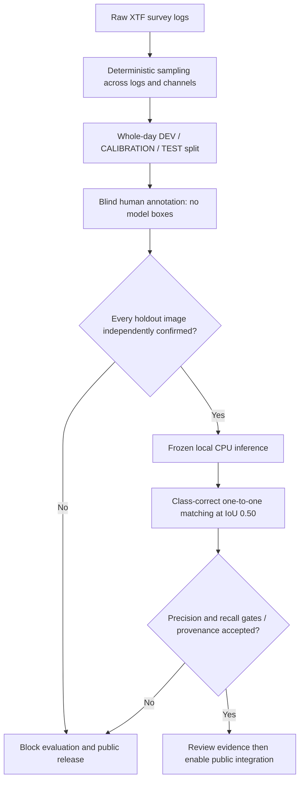

# XTF accuracy and public release gate

Prepared 3 October 2026. No weights are trained or changed. Public XTF inference remains disabled until reviewed performance evidence is accepted. Local XTF predictions are exploratory and remain REVIEW.

## Available data

`datasets/xtf` contains 143 raw USGS survey logs and survey metadata, not target annotations. Navigation, vessel diagrams and file headers do not prove a contact is a pipe, net, mine or wreck. No qualified human has supplied those annotations yet. These geological survey logs may not cover all five detector classes.

## Prepared workflow



### Extract and review

```powershell
python -B scripts/prepare_xtf_review_pool.py datasets/xtf --output .temp/xtf-independent-review --logs-per-day 4
python -m http.server 8768 --bind 127.0.0.1 --directory .temp/xtf-independent-review
```

Open `http://127.0.0.1:8768/`. Both supported channels are sampled through the selected complete logs using a deterministic reservoir, not detector confidence. The first/last and intermediate logs of each acquisition day are selected. These are log segments, **not verified independent survey lines**. Last day is TEST, preceding day CALIBRATION, earlier days DEV. No random adjacent-window split or training is performed. Source/raster/rendering hashes, channel, ping range and source sidecars preserve provenance. The same survey is not an independent external survey.

A reviewer qualified to interpret side-scan sonar must draw all independently confirmed objects, identify confirmed empty background, and keep uncertain images marked uncertain. The annotation UI displays no predictions or split role. Save each review and download the complete annotations JSON. Review edits are local browser state until exported; keep a backup. Model predictions must not be treated as truth. The qualification checkbox is an attestation, not independent certification of the reviewer.

Unreviewed and uncertain holdout images block evaluation rather than silently being treated as background. If the available survey has no confirmed instances of a class, acquire independently labelled data covering that class; do not invent boxes or restrict the advertised claim after seeing results. Audit survey-line/time overlap and all existing training sources before treating the holdout as untouched. Only after that audit may `split_provenance_verified` be recorded. `independent_external_validation` needs an actual separate survey, not simply another file from Grand Bay.

### Evaluate after annotations exist

```powershell
python -B scripts/evaluate_xtf_holdout.py .temp/xtf-independent-review independent-survey-annotations.json --output .temp/xtf-frozen-evaluation-001
```

This runs the current frozen detector/fusion locally on all TEST images, with detector confidence 0.15, tiled analysis enabled, no decision/fusion filter, one-to-one class-correct IoU >=0.50 matching. The operating point is fixed before the holdout run; this script does not tune it. Output saves raw analysis, predictions and object-level evaluation with input/artifact hashes. Duplicate boxes are false positives; wrong-class detections count as false positives and missed true objects. Failed/missing images cannot disappear from the denominator.

The conservative initial gate requires overall **and each advertised class** precision and recall >=90%, at least 30 confirmed TEST targets per class and 20 confirmed background windows, verified split/training independence and independent external-survey evidence. These are proposed release criteria, not promised results. Report Wilson intervals; they do not account for correlated survey samples. This evaluator does not compute mAP, verify physical dimensions, calibrate probabilities or certify field reliability. Public integration still requires evidence review; no editable JSON flag automatically enables the website.

## Module 1 closure ledger

| Item | Current closure evidence / remaining dependency |
| --- | --- |
| Shared records and review history | User confirmed signed-in save/refresh/open and restored note |
| Durable usage controls | Five hosted SQL checks passed; maintenance HTTP 200 observed |
| Automatic retention / actual expired-image removal | Invocation and rollback/failure safeguards verified; a real scheduled expiry deletion still not witnessed |
| XTF parsing and rendering | Complete supported corpus scanned; low-amplitude conversion repaired; local raw-to-viewer/report tested |
| Raw target accuracy / public inference | Review pack, blind annotation UI and frozen evaluator prepared; qualified labels and successful gate missing |
| Geolocation / physical dimensions | Explicit metadata and source-bound geometry supported; independent known target measurements still missing |
| Acquisition corrections | Quality flags and bounded flat-bottom/yaw handling exist; full beam/heave/terrain correction not implemented or validated |
| Edge integration | Authenticated bounded image endpoint implemented; hardware certification deferred at user's request |
| Calibration | Explicitly unavailable until Module 2 provides compatible verified estimates |

M1 is **not fully certified** while the listed evidence or implementation gaps remain. No document, endpoint or passing mock test substitutes for field data, expert labels or synchronized motion measurements. Future edge hardware is now a documented integration path, not a required physical benchmark for this prototype release; Windows measurements remain the only actual measurements.
