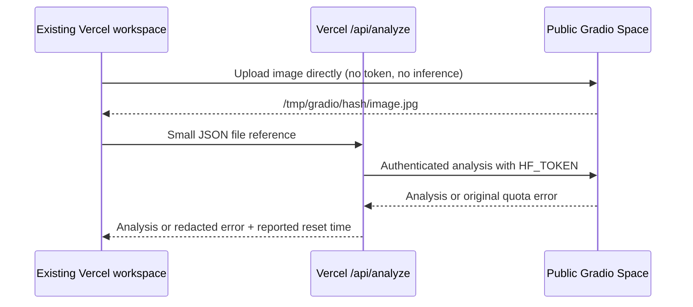

# Deployed Hugging Face integration

The frontend uploads the image directly to the public Gradio Space `mrintrovert19/sonar-shield-api`. It sends the returned file reference to the same-origin Vercel Function `POST /api/analyze`. That function calls `/analyze_image_gradio` with a server-only `HF_TOKEN`, `image_filepath`, and `run_tiled_auxiliary: true`. It unwraps the JSON object in the first Gradio output; the browser validates it against the F8 analysis schema before display. The frontend never derives decisions, reliability, fusion, or localization.

## Configure authentication before deployment

1. Create a dedicated **read** token for your free Hugging Face account at [HF token settings](https://huggingface.co/settings/tokens). Do not paste it into chat, source code, screenshots, or browser settings.
2. In the Vercel project whose root is `frontend`, open **Settings → Environment Variables**. Add `HF_TOKEN` as a server-only secret for **Production**, and `APP_ORIGIN=https://sonarshield26.vercel.app` for **Production**. For previews, configure the token only if you intend to spend the same quota there; leave `APP_ORIGIN` unset so the function accepts that preview's `VERCEL_URL` origin. An alias for a preview needs its exact `APP_ORIGIN`.
3. Enable **Fluid Compute** and deploy the new commit. The function is configured for 300 seconds; the gateway stops waiting at 270 seconds and attempts cancellation. Redeployment is required for changed environment variables to apply.
4. Run one uploaded image through Vercel. Confirm `LIVE ANALYSIS`, candidates, review, report, and exports. Check Vercel logs for the error code if it fails, without adding token logging. A reachable metadata check is not evidence of authenticated inference or available quota.

**Never create `VITE_HF_TOKEN` or another `VITE_*` credential.** Vite public variables can be bundled into downloadable JavaScript. The release guard rejects HF token variable names in public build configuration. The gateway never returns the token, accepts no client-supplied Space ID or endpoint, and only accepts JPG/PNG cache paths matching this Space's verified `/tmp/gradio/<64-hex-hash>/<filename>` upload layout. The browser sends no file bytes to the gateway, so images larger than Vercel's 4.5 MB body limit still upload directly to HF. No image recompression or resizing is introduced.

Missing/invalid configuration produces `HF_AUTH_NOT_CONFIGURED`; rejected credentials produce `HF_AUTH_FAILED`. Neither silently falls back to anonymous inference. This is authentication, **not unlimited inference**: every gateway visitor uses the service account's finite quota, including your direct HF runs authenticated as that account. Same-origin checks prevent ordinary cross-site browser use, but they are not authentication or a robust abuse limiter—non-browser callers can forge Origin. A public gateway can still exhaust the account's allowance.

## Local development and rollback

In `frontend`, copy `.env.gateway.example` to `.env.gateway.local` and enter the token there. That `.local` file is ignored by Git. Run `npm run dev:gateway` in one terminal and `npm run dev` in another; open `http://localhost:5173`. If you use `127.0.0.1` or a different port, change the local `APP_ORIGIN` accordingly. Node must support `--env-file-if-exists` (the project's supported recent Node versions do). Plain `vite preview` does not emulate Vercel Functions; browser tests intercept the gateway and do not consume quota.

To roll back, promote the previous Vercel deployment or revert the gateway commit and redeploy. The previous build uses anonymous direct inference and may encounter its lower quota. Removing `HF_TOKEN` alone is not a rollback; it deliberately disables gateway inference while keeping verified examples usable.

Local release QA for this change passed 34 unit/transport tests, lint, TypeScript, and the production build. Mocked browser scenarios cover success, quota with and without a countdown, authentication failure, offline service, invalid output, cancellation, and an image larger than 4.5 MB. The separate offline walkthrough checks all four verified examples, review, report, print, and exports without additional inference. To verify deployment, run `python tests/browser_live_gateway.py --live` explicitly: it makes **one real GPU request**, then checks review/report/JSON export. Local mocks alone do not certify production authentication or quota availability.

The prior deployed Vercel bundle called `/predict`; the Space does not expose that endpoint. It also parsed the JSON output as a string and labeled all failures `API_OFFLINE`. The corrected adapter uses `handle_file(file)`, the named Gradio input object, and the actual endpoint. Endpoint mismatch, malformed output, and service failure now have distinct errors. The Space metadata being reachable is shown as `REACHABLE`; it does not prove model/component health or inference readiness.

The Space publishes no separate `/health`, `/detect`, `/report`, or human review endpoint. The report page renders the current validated analysis in the browser and provides JSON, CSV, and Print exports. Human review remains local to the browser. No generated backend report ID or component health is shown.

## Judging when ZeroGPU is unavailable

The main path submits the uploaded image for live analysis and labels a successful response **LIVE ANALYSIS**. A reachable Space API does not mean ZeroGPU has capacity; the UI says **GPU UNVERIFIED** until a run succeeds, and a quota error is labeled **LIVE GPU LIMIT REACHED**. The error names the authenticated service account's quota and preserves the original bounded, token-redacted message in **Technical details**. When HF supplies a `Try again in H:MM:SS` countdown, the gateway records its receipt time and reset timestamp; the browser updates the remaining wait without making inference calls. If no countdown was supplied, the UI says **Reset time was not supplied by Hugging Face.** The uploaded image stays visible. The user may explicitly choose **View verified example** or **Try live again later**; there is no automatic fallback or retry. Cancel stops browser waiting and the gateway attempts upstream cancellation; GPU time already consumed may still count.

The **Explore verified examples** button is available before any upload. Contact 105, 103, 104, and the zero-candidate background bundle real sample images with precomputed F9 responses. The frontend validates the response and checks each image SHA-256 before display. Example selection makes no Space inference request. The viewer, review area, report, print output, and downloaded JSON/CSV disclose **PRECOMPUTED EXAMPLE · NOT LIVE INFERENCE**. This is a replay of the displayed sample, never an analysis of an uploaded image. The Oracle Micro VM is not used for inference.

For Vercel, deploy the `frontend` directory as the project root with Vite build command `npm run build:release` and output directory `dist`. `VITE_GRADIO_SPACE_ID` may be set to `mrintrovert19/sonar-shield-api`; that is also the default. Keep `VITE_DEMO_MODE` and `VITE_USE_MOCK_DATA` false. `VITE_API_BASE_URL` is used only by legacy local FastAPI utilities and is not the deployed Gradio target. `vercel.json` rewrites client routes to `index.html`; static assets remain served directly.

After redeployment, load `/analysis` directly, check the Space status says that GPU capacity is unverified, and open Contact 105 through **Explore verified examples**. Confirm two candidates and boxes, save a human review, inspect the report, and check the print and exports for the precomputed label. Then try a live upload when ZeroGPU capacity is available and confirm it is labeled **LIVE ANALYSIS**. Check the browser console and network activity. Run `python tests/browser_judge_fallback.py` against the local production preview on port 4182 for a no-inference offline walkthrough.
